# Architecture

## Runtime chain

```mermaid
flowchart LR
    Q["Qt / Camera API client"] --> H["four_stage_server"]
    H -->|"Camera CRUD / query"| DB["PostgreSQL"]
    H -->|"People Flow + Camera commands"| R["Redis Streams / hot state"]
    R --> W["four_stage_worker / VisionWorkerHost"]
    C["RTSP camera profile"] -->|"one FFmpeg reader per profile"| F["Shared FrameHub"]
    W --> F
    F -->|"immutable latest frame"| P["People Flow subscription"]
    F -->|"independent cursors"| T1["CameraPipeline A"]
    F --> T2["CameraPipeline B"]
    M["yolo11n-pose.engine"] -->|"TensorRT + CUDA"| P
    P --> A["Tracking + fence + pose + temporal"]
    A --> PF["People Flow Redis / PostgreSQL / snapshots"]
    T1 --> BW["bounded CPU JPEG writer pool"]
    T2 --> BW
    BW --> CF["latest.jpg / archive files"]
    T1 -->|"latest-only analysis jobs"| IW["Fixed W inference workers"]
    T2 --> IW
    M --> IW
    IW --> AP["Per-camera algorithm sessions"]
    AP -->|"alert + outbox, one transaction"| DB
    DB -->|"SKIP LOCKED claim + fenced lease"| CB["Callback delivery worker"]
    CB -->|"HMAC-signed HTTP POST, at least once"| BE["External backend"]
    W -->|"Pipeline / inference / processor / callback heartbeat"| R
    PF --> H
    CF --> DB
    DB --> H
    R --> H
```

The HTTP process does not load CUDA, TensorRT, or camera credentials. It submits
session/Run commands to Redis and combines durable PostgreSQL records with hot
state. The single worker process owns camera URI resolution, the Hub Registry,
the sole FFmpeg reader per profile, People Flow GPU inference, CameraPipeline
threads, the fixed Camera inference pool, and CPU JPEG extraction.

The first release deliberately requires `worker_num=1`; process-local sharing
cannot prevent two independent workers from opening two RTSP connections.
Readiness fails when this invariant is violated. Inference parallelism is
configured separately with `analysis.inference_workers=W`: the Worker creates
exactly W model runners at startup and never creates one per camera.

## Public API kept in the compact project

- `GET /api/v1/health`
- `GET /api/v1/ready`
- `POST /api/v1/people-flow/start`
- `POST /api/v1/people-flow/{session}/stop`
- `GET /api/v1/people-flow/{session}/status`
- `GET /api/v1/people-flow/{session}/snapshot`
- `GET /api/v1/people-flow/{session}/security`
- `GET /api/v1/people-flow/cameras/{camera}/realtime`
- `GET /api/v1/people-flow/cameras/{camera}/events`

Camera Task routes are registered only with `camera_tasks.enabled=true`:

- `POST/GET /api/v1/cameras`
- `GET/PATCH/DELETE /api/v1/cameras/{camera_id}`
- `POST /api/v1/cameras/{camera_id}/start`
- `POST /api/v1/cameras/{camera_id}/stop`
- `GET /api/v1/cameras/{camera_id}/status`
- `GET /api/v1/cameras/{camera_id}/latest-frame`
- `GET /api/v1/cameras/{camera_id}/runs`
- `GET /api/v1/cameras/{camera_id}/alerts`
- `GET /api/v1/camera-hubs`
- `GET /api/v1/camera-hubs/{profile}`

Every Camera route uses Bearer authentication. Hub diagnostics are read-only;
no consumer can manually start or stop a Hub.

No classification, segmentation, OBB, generic image-upload, generic video or
generic stream routes are registered or built.

## Shared Hub lifecycle and fault domains

The first subscription creates and starts the profile Hub. Subsequent
subscriptions receive independent latest-frame cursors. Consumers cannot stop
the reader. After the final subscription is released, idle grace avoids
connection churn; expiry closes and evicts the Hub.

RTSP open/read/reconnect and resolution changes are shared camera-level state.
An extraction encoder, queue, metadata, or disk failure is Run-local. The
bounded writer rejects samples at capacity so storage cannot back-pressure the
Hub or People Flow inference.

Frame objects are `shared_ptr<const FrameEnvelope>`. Rendering clones before
modification. The Hub keeps no historical ring buffer; archive history exists
only after JPEG publication.

## Camera state, inference, and output

Camera definitions, Runs, archive-frame metadata, alerts, and callback outbox
use PostgreSQL. Redis carries nonsecret commands, leases, stop flags, hot Run
status, and Hub snapshots. Startup reconciliation marks stale nonterminal Runs
failed; it does not fabricate a replacement Run.

Each active `camera_id` owns one CameraPipeline thread. JPEG sampling and
analysis sampling have independent monotonic cadences. Analysis jobs use stable
camera-to-worker affinity and retain at most one pending latest frame per
camera. Generation tokens suppress in-flight results after a Run is stopped or
replaced.

Latest publication and archive publication use destination-directory temporary
files followed by atomic replacement/rename. Archive metadata is inserted only
after the file is published. Retention validates identifiers, canonical roots,
and reparse points and deletes individual files only.

Stateful tracking, counting, fence, pose, and temporal rules execute after the
fixed inference pool. When a callback profile is present, the durable alert and
its pending outbox record commit in one PostgreSQL transaction.

The callback worker claims due outbox rows with `FOR UPDATE SKIP LOCKED`,
increments an attempt fencing token, and stores a lease deadline in
`next_attempt_at_ms`. Any 2xx completes delivery. Transport errors, timeout,
408, 429, and 5xx use bounded exponential retry; other 4xx and exhausted
attempts enter dead letter. Expired `delivering` leases are reclaimed after a
worker crash. Redirects are disabled, HTTP is forbidden unless explicitly
allowed for a test profile, and only a SHA-256 response-body hash is persisted.

The Worker flattens process-local Pipeline, inference-pool, Processor, and
callback snapshots into its existing Redis heartbeat. The Server treats the
heartbeat as expiring hot state: `/ready` requires a fresh snapshot and the
configured components to be running, while `/operations/metrics` merges these
counters with durable PostgreSQL outbox totals. A missing or stale heartbeat is
never presented as a zero-valued healthy worker.

Dead-letter inspection stays on the Server/Repository side. Manual replay uses
the observed attempt as `If-Match`; one atomic PostgreSQL update can move only
that exact `dead_letter` generation back to `retry`. Callback URLs, secrets,
request bodies, and response bodies remain outside every operations response.

## Four stages

1. Electronic fence: enter, dwell and exit state machine.
2. Person tracking: stable IDs, alpha-beta prediction, trails and line crossing.
3. Pose rules: hands up, crouch, fall, running and loitering candidates.
4. Temporal demo: speed-window `RAPID_MOTION_DEMO`; this is not a trained
   violence/fight classifier.
