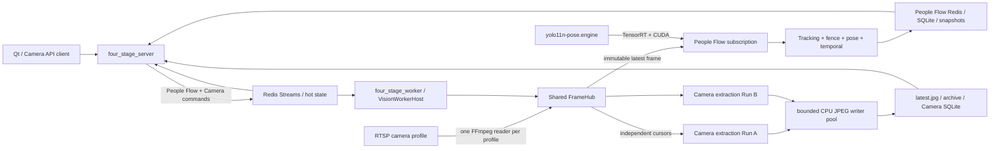

# Architecture

## Runtime chain

The HTTP process does not load CUDA, TensorRT, or camera credentials. It submits
session/Run commands to Redis and combines durable SQLite records with hot
state. The single worker process owns camera URI resolution, the Hub Registry,
the sole FFmpeg reader per profile, People Flow GPU inference, and CPU JPEG
extraction. Camera extraction does not invoke the model.

The first release deliberately requires `worker_num=1`; process-local sharing
cannot prevent two independent workers from opening two RTSP connections.
Readiness fails when this invariant is violated.

## Public API kept in the compact project

- `GET /api/v1/health`
- `GET /api/v1/ready`
- `POST /api/v1/people-flow/start`
- `POST /api/v1/people-flow/{session}/stop`
- `GET /api/v1/people-flow/{session}/status`
- `GET /api/v1/people-flow/{session}/snapshot`
- `GET /api/v1/people-flow/{session}/security`
- `GET /api/v1/people-flow/cameras/{camera}/realtime`
- `GET /api/v1/people-flow/cameras/{camera}/events`

Camera Task routes are registered only with `camera_tasks.enabled=true`:

- `POST/GET /api/v1/camera-tasks`
- `GET/PATCH/DELETE /api/v1/camera-tasks/{task}`
- `POST /api/v1/camera-tasks/{task}/start`
- `POST /api/v1/camera-tasks/{task}/stop`
- `GET /api/v1/camera-tasks/{task}/status`
- `GET /api/v1/camera-tasks/{task}/latest-frame`
- `GET /api/v1/camera-tasks/{task}/runs`
- `GET /api/v1/camera-hubs`
- `GET /api/v1/camera-hubs/{profile}`

Every Camera route uses Bearer authentication. Hub diagnostics are read-only;
no consumer can manually start or stop a Hub.

No classification, segmentation, OBB, generic image-upload, generic video or
generic stream routes are registered or built.

## Shared Hub lifecycle and fault domains

The first subscription creates and starts the profile Hub. Subsequent
subscriptions receive independent latest-frame cursors. Consumers cannot stop
the reader. After the final subscription is released, idle grace avoids
connection churn; expiry closes and evicts the Hub.

RTSP open/read/reconnect and resolution changes are shared camera-level state.
An extraction encoder, queue, metadata, or disk failure is Run-local. The
bounded writer rejects samples at capacity so storage cannot back-pressure the
Hub or People Flow inference.

Frame objects are `shared_ptr<const FrameEnvelope>`. Rendering clones before
modification. The Hub keeps no historical ring buffer; archive history exists
only after JPEG publication.

## Camera state and output

Camera Task definitions, Runs, and archive-frame metadata use the separate
`camera_tasks.db`. Redis carries nonsecret commands, leases, stop flags, hot Run
status, and Hub snapshots. Startup reconciliation marks stale nonterminal Runs
failed; it does not fabricate a replacement Run.

Latest publication and archive publication use destination-directory temporary
files followed by atomic replacement/rename. Archive metadata is inserted only
after the file is published. Retention validates identifiers, canonical roots,
and reparse points and deletes individual files only.

## Four stages

1. Electronic fence: enter, dwell and exit state machine.
2. Person tracking: stable IDs, alpha-beta prediction, trails and line crossing.
3. Pose rules: hands up, crouch, fall, running and loitering candidates.
4. Temporal demo: speed-window `RAPID_MOTION_DEMO`; this is not a trained
   violence/fight classifier.
