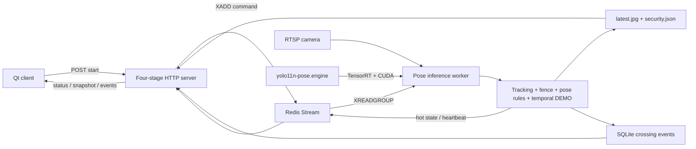

# Architecture

## Runtime chain

The HTTP process does not load CUDA or TensorRT. It submits session commands to
Redis and exposes query endpoints. The worker owns the RTSP connection, GPU
engine and all frame processing. This keeps the Redis boundary visible even on
one machine and allows the worker to be moved to another GPU host later.

## Public API kept in the compact project

- `GET /api/v1/health`
- `GET /api/v1/ready`
- `POST /api/v1/people-flow/start`
- `POST /api/v1/people-flow/{session}/stop`
- `GET /api/v1/people-flow/{session}/status`
- `GET /api/v1/people-flow/{session}/snapshot`
- `GET /api/v1/people-flow/{session}/security`
- `GET /api/v1/people-flow/cameras/{camera}/realtime`
- `GET /api/v1/people-flow/cameras/{camera}/events`

No classification, segmentation, OBB, generic image-upload, generic video or
generic stream routes are registered or built.

## Four stages

1. Electronic fence: enter, dwell and exit state machine.
2. Person tracking: stable IDs, alpha-beta prediction, trails and line crossing.
3. Pose rules: hands up, crouch, fall, running and loitering candidates.
4. Temporal demo: speed-window `RAPID_MOTION_DEMO`; this is not a trained
   violence/fight classifier.
