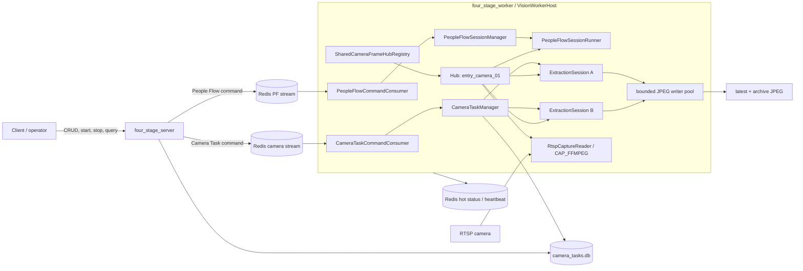
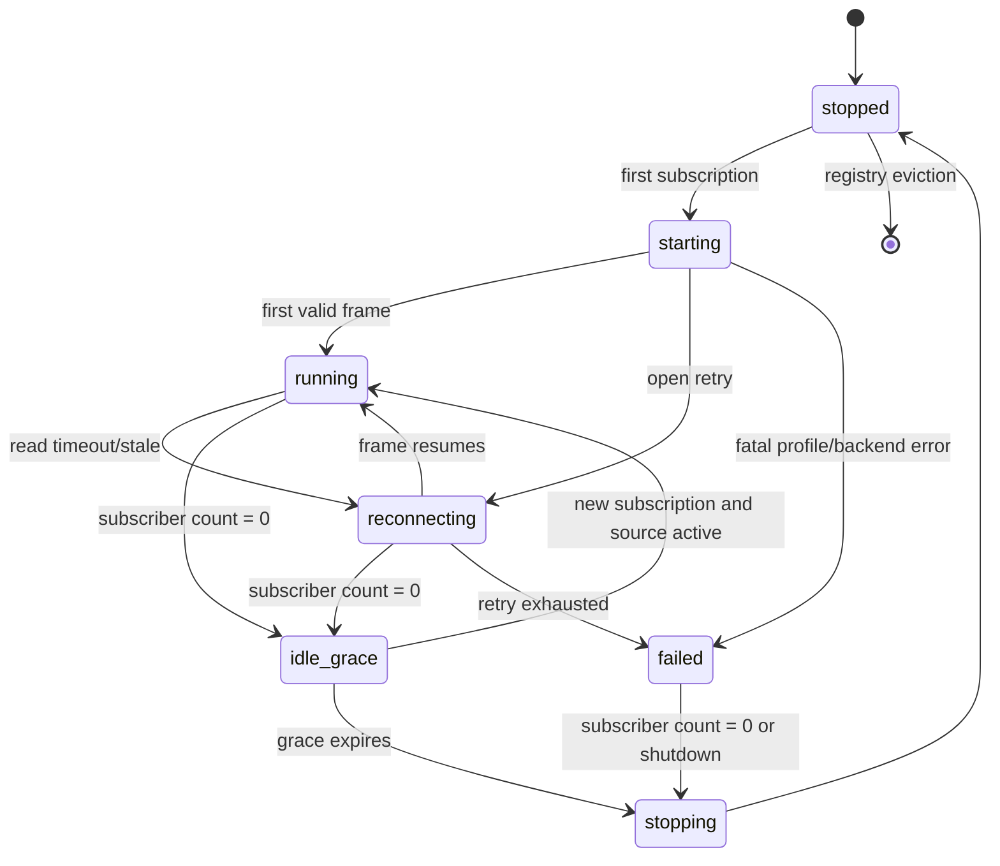
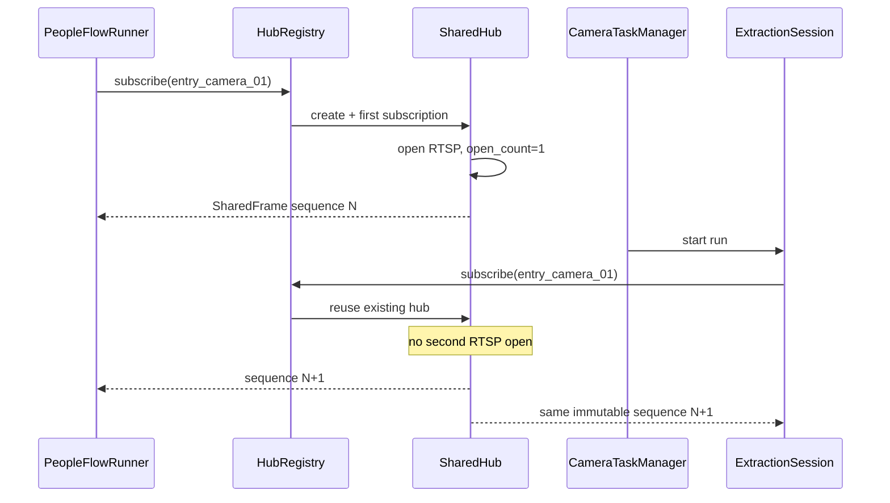
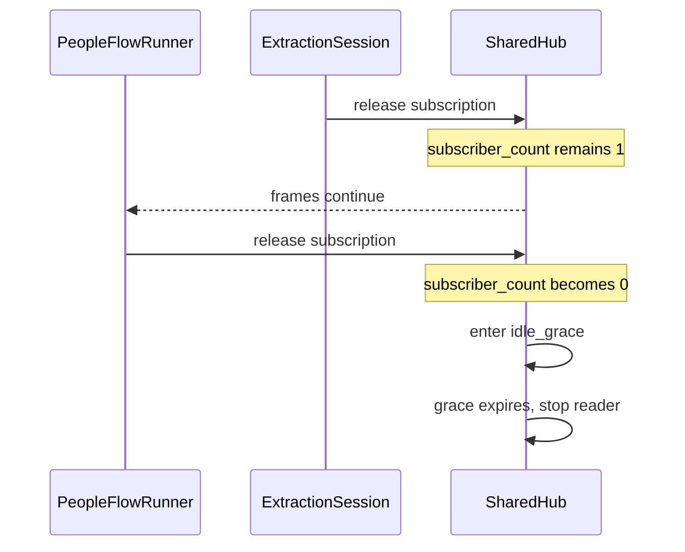
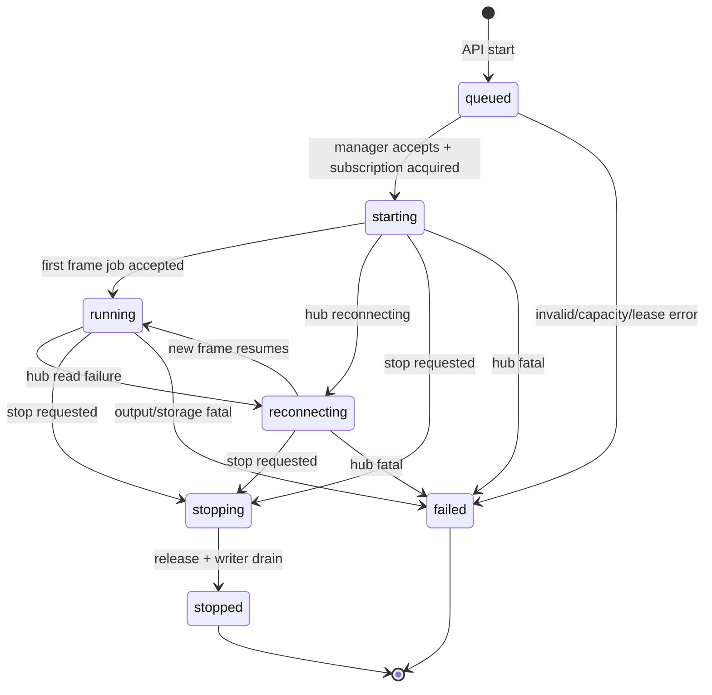

# 共享 RTSP FrameHub 与摄像头抽帧任务——详细设计

> 设计版本：v0.2  
> 状态：方案 3 已确认，未实现  
> 核心选择：People Flow 与抽帧任务在同一 `four_stage_worker` 内共享一次 RTSP 解码  
> 关联规划：[CAMERA_FFMPEG_FRAME_TASK_PROJECT_PLAN.md](CAMERA_FFMPEG_FRAME_TASK_PROJECT_PLAN.md)

## 1. 设计摘要

本设计把现有 `four_stage_worker` 重构为 `VisionWorkerHost`。WorkerHost 内部持有一个 `SharedCameraFrameHubRegistry`，每个 `camera_profile` 对应一个 Hub。Hub 独占一个 `RtspCaptureReader`，通过 OpenCV `CAP_FFMPEG` 建立 RTSP 连接并持续解码，把不可变的最新帧发布给多个 Subscription。

People Flow 和 Camera Frame Extraction 分别作为 Hub 消费者：

- People Flow 按 `target_infer_fps` 拉取最新 sequence 并执行 TensorRT 推理；
- 每个抽帧 Run 按自己的 `frame_interval_ms` 拉取最新 sequence 并异步保存 JPEG；
- 消费者不共享业务状态，不互相停止，不互相阻塞；
- 摄像头连接、解码、重连和 capture 指标由 Hub 统一拥有。

任务定义和历史以 SQLite 为准；People Flow 与 Camera Task 继续使用各自 Redis 命令/状态 keyspace；WorkerHost 同时消费两套命令流。第一版只支持一个 WorkerHost 进程，因此“一次连接/解码”是进程内强保证。

## 2. 设计目标与不变量

### 2.1 目标

1. 同 Profile 多消费者只建立一条 RTSP 连接；
2. People Flow 现有业务语义保持兼容；
3. Camera Task 支持完整 CRUD 与独立启停；
4. 慢消费者不制造帧积压，也不阻塞其他消费者；
5. 任一抽帧任务的编码/磁盘故障不影响 People Flow；
6. RTSP URI 不跨越 WorkerHost 的秘密边界；
7. 连接共享、订阅者、跳帧和故障状态可观测。

### 2.2 必须始终成立的不变量

- `HubRegistry` 内同一规范化 `camera_profile` 最多一个 Hub；
- 一个 Hub 最多一个活动 reader/capture thread；
- 消费者不能直接 start/stop reader；
- Hub 的生命周期只由 Registry、订阅引用和 WorkerHost shutdown 控制；
- 发布后的 `FrameEnvelope` 对所有消费者只读；
- 每个 Subscription 的 cursor 独立；
- 没有全局 delivered cursor；
- 没有无界帧队列；
- 同一 Camera Task 最多一个活动 Run；
- People Flow 停止不等于摄像头停止；只有最后一个订阅者释放后 Hub 才进入关闭流程；
- URI 不进入 HTTP、SQLite、Redis、普通日志或命令字段；
- 第一版 `worker_num` 必须为 1。

## 3. 当前实现约束

### 3.1 阻塞式 People Flow Worker

当前 `PeopleFlowInferenceWorker::loop()` 从 Redis 取出一个命令后直接调用 `processTask()`，而 `processTask()` 会持续到会话停止。因此同一个线程无法同时处理 Camera Task 命令。

本设计将其拆分为：

```text
PeopleFlowCommandConsumer → PeopleFlowSessionManager → PeopleFlowSessionRunner thread
CameraTaskCommandConsumer → CameraTaskManager       → ExtractionSession threads
```

命令消费者只做验证、幂等检查和 session 派发，不执行长循环。

### 3.2 单消费者 `RtspCaptureReader`

当前 reader 内部有 `delivered_sequence_`，`getLatestFrame()` 会修改该值；capture thread 还用它计算 dropped frames。多个消费者共用时会相互覆盖消费语义。

本设计把 reader 改为纯生产者：

- reader 负责连接、解码和 capture 指标；
- Hub 负责不可变帧发布；
- Subscription 自己记录 last seen sequence；
- skipped 数量按 Subscription 计算；
- reader 不知道有多少消费者。

### 3.3 FFmpeg transport 是进程级状态

OpenCV 使用 `OPENCV_FFMPEG_CAPTURE_OPTIONS` 设置 RTSP TCP/UDP，它是进程环境变量。多个 Hub 同时 open/reconnect 时必须串行执行“设置选项 + open + backend 校验”。

## 4. 领域模型

### 4.1 Camera Profile

Profile 继续来自静态配置：

```yaml
cameras:
  entry_camera_01:
    source_type: "rtsp"
    url_env: "YOLO11_CAMERA_ENTRY_URL"
    display_name: "Main Entrance"
    transport: "tcp"
    enabled: true
```

Hub key 使用 `profile.id`。URI 只在首次启动 reader 时从 `url_env` 解析。

### 4.2 FrameEnvelope

Hub 发布的不可变帧：

```cpp
struct FrameEnvelope {
    std::uint64_t sequence = 0;
    long long capture_time_ms = 0;
    std::chrono::steady_clock::time_point publish_time;
    int width = 0;
    int height = 0;
    bool resolution_changed = false;
    cv::Mat image;
};

using SharedFrame = std::shared_ptr<const FrameEnvelope>;
```

约束：

- capture thread 构造完整 envelope 后一次性发布；
- 发布后不再修改 envelope 或其 `cv::Mat` 数据；
- `IModelRunner::infer(const cv::Mat&)` 可直接只读消费；
- renderer、overlay、resize 等可能修改像素的逻辑必须先 clone 或生成新 Mat；
- shared frame 被所有消费者释放后自动回收。

### 4.3 FrameSubscription

Subscription 是消费者与 Hub 的 RAII 句柄：

```cpp
struct FrameReadResult {
    SharedFrame frame;
    std::uint64_t skipped_since_last_read = 0;
};

class FrameSubscription {
public:
    bool tryReadLatest(FrameReadResult& out);
    CameraHubStatus hubStatus() const;
    SubscriptionMetrics metrics() const;
};
```

每个 Subscription 保存：

- subscriber ID/type；
- last seen sequence；
- consumed frames；
- skipped frames；
- last consume time；
- 创建时间。

释放 Subscription 只减少引用，不直接停止 Hub。

### 4.4 Camera Task

持久化任务定义字段：

| 字段 | 类型 | 规则 |
|---|---|---|
| `task_id` | string | 服务端生成，前缀 `ct_` |
| `name` | string | 1～128 UTF-8 字符 |
| `camera_profile` | string | 必须存在且启用 |
| `enabled` | bool | false 时不能 start |
| `frame_interval_ms` | int | 100～3,600,000，默认 1000 |
| `output_mode` | enum | `latest/archive/both` |
| `jpeg_quality` | int | 1～100，默认 90 |
| `max_width` | int | 0 或 64～8192 |
| `max_height` | int | 0 或 64～8192 |
| `retention_days` | int | 1～3650，默认 7 |
| `max_saved_frames` | int | 1～1,000,000，默认 100,000 |
| `version` | int | 乐观锁，从 1 开始 |
| `created_at_ms` | int64 | 服务端时间 |
| `updated_at_ms` | int64 | 服务端时间 |
| `deleted_at_ms` | int64/null | 软删除 |

### 4.5 Camera Task Run

每次 start 创建 Run ID `cr_...`，保存不可变定义快照。状态：

```text
queued → starting → running ↔ reconnecting → stopping → stopped
                     └──────────────────────────────→ failed
```

`waiting_for_hub` 不单独作为持久化状态；Hub 尚未出帧时 Run 保持 `starting`，并在 status 中展示 hub state。

### 4.6 Frame Artifact

archive 模式成功保存的 JPEG 对应 `cf_...` 元数据。`latest.jpg` 是当前发布文件，不建立逐版本 Artifact。

## 5. 总体架构



### 5.1 进程边界

#### `four_stage_server`

- 保留现有 People Flow API；
- 新增 Camera Task API；
- 管理任务定义、查询历史、提交命令；
- 不解析 RTSP URI，不打开摄像头；
- 不加载 CUDA/TensorRT。

#### `four_stage_worker`

- executable 名称不变；
- 类职责升级为 `VisionWorkerHost`；
- 同时消费 People Flow 和 Camera Task 命令；
- 持有唯一 Hub Registry；
- 持有一个 People Flow ModelRunner；
- 持有 Camera Task Manager 和 writer pool；
- 统一心跳、健康、停止和恢复。

不新增第三个后台进程。

## 6. 核心组件设计

### 6.1 VisionWorkerHost

职责：

- 加载 AppConfig 和 Camera Profiles；
- 校验 `worker_num=1`；
- 初始化 Redis connections、People Flow Repository、Camera Task Repository；
- 初始化 ModelRunner；
- 创建 Hub Registry；
- 启动两套命令消费者；
- 管理 session managers、writer pool、heartbeat、reconciler 和 retention；
- 按顺序优雅停止。

第一版继续在 WorkerHost 启动时初始化 ModelRunner，以保持现有 `/ready` 语义和 People Flow 首次启动延迟。未来可做 lazy GPU init，但不属于本期。

### 6.2 SharedCameraFrameHubRegistry

核心接口：

```cpp
class SharedCameraFrameHubRegistry {
public:
    SubscriptionResult subscribe(
        const std::string& camera_profile,
        const SubscriberDescriptor& subscriber);
    std::vector<CameraHubSnapshot> snapshots() const;
    void stopAll() noexcept;
};
```

行为：

1. 验证 Profile 存在且启用；
2. 在 mutex 下查找或创建 Hub；
3. 新 Hub 数量不得超过 `max_active_hubs`；
4. 在锁外启动 Hub，避免持 registry 锁做网络 I/O；
5. 并发首次订阅通过 Hub 内 start state 合并为一次 start；
6. 返回 Subscription；
7. Hub 无订阅且完全停止后可从 Registry 回收。

Registry map key 只使用 Profile ID；不使用 URI，避免秘密进入 key、日志或诊断。

### 6.3 SharedCameraFrameHub

Hub 拥有：

- Camera Profile 非秘密副本；
- 一个 reader/source；
- 最新 `SharedFrame`；
- Hub 状态与 capture metrics；
- 订阅者描述和数量；
- idle grace timer/generation；
- `open_count`、启动时间和最后发布时间。

Hub 不拥有：

- People Flow tracker/counter；
- Camera Task interval/output；
- JPEG writer；
- 任何消费者的业务终态。

发布采用 C++17 支持的 `atomic_load/atomic_store` shared_ptr free functions，或短 mutex 交换 shared_ptr。禁止锁内 clone 全帧。

### 6.4 Hub 生命周期



细节：

- `starting` 在 open 成功但未取得首帧前保持；
- `running` 的定义是至少发布过一张当前连接的有效帧；
- reconnect 期间保留最后 SharedFrame，但消费者必须按帧年龄拒绝 stale frame；
- idle grace 默认 5000 ms；
- 新订阅取消 grace 时不增加 `open_count`；
- fatal failure 会通知订阅者；订阅者决定自身 Run/Session 是否失败；
- shutdown 无视 grace，直接 stopping。

### 6.5 RtspCaptureReader 重构

建议从“reader 自己保存 latest”调整为 source callback：

```cpp
using FramePublishCallback = std::function<void(CapturedFrame&&)>;
using StatePublishCallback = std::function<void(const RtspCaptureMetrics&)>;
```

或者保留轮询接口，但必须删除 `delivered_sequence_`。优先 callback，因为 Hub 是唯一 reader 消费者。

修改点：

- source sequence 在 reader/capture thread 单调递增；
- `CapturedFrame.image` move 到 Hub envelope，避免 capture→Hub clone；
- dropped metric 改为 `overwritten_before_publish` 或删除；
- Profile transport 由 Hub 传入；
- open 委托 `FfmpegOpenCoordinator`；
- URI 停止后覆盖清理；
- backend 必须包含 `FFMPEG`；
- 不允许 `CAP_ANY` fallback。

### 6.6 FfmpegOpenCoordinator

进程级 singleton/member，所有 Hub 共用一个 mutex：

```text
lock
  set OPENCV_FFMPEG_CAPTURE_OPTIONS for profile transport
  capture.open(uri, CAP_FFMPEG, timeout params)
  read backend name
unlock
```

仅 open/reopen 串行，已经打开的 capture read 不持锁。backend 不含 `FFMPEG` 时释放 capture 并返回清洗后的 `FFMPEG_BACKEND_REQUIRED`。

### 6.7 PeopleFlowSessionManager / Runner

Manager：

- 消费 People Flow 命令后检查现有 camera/session lease；
- 第一版最多一个活动 Runner；
- 创建独立 session thread；
- 命令接收线程立即继续消费/心跳；
- 负责 join、终态和异常边界。

Runner：

1. 从 Registry 订阅 `task.camera_profile`，subscriber type=`people_flow`；
2. 不再创建 `RtspCaptureReader` 或解析 URI；
3. 查询 Hub 状态填充现有 capture status；
4. 按 `target_infer_fps` 调用 Subscription `tryReadLatest()`；
5. 直接把只读 Mat 传给 `runner_->infer()`；
6. renderer/overlay 输出使用新 Mat，不修改 SharedFrame；
7. reconnect count 变化时执行现有 tracker/counter warmup/reset 逻辑；
8. 停止时释放 Subscription，而不是调用 capture.stop()；
9. 保持 People Flow lease、Redis schema、SQLite 和事件行为。

People Flow `capture.dropped_frames` 改为该 Subscription 的 `skipped_frames`，并新增 `shared_hub=true`、`hub_subscribers`。API 兼容字段含义需在迁移说明中标注。

### 6.8 CameraTaskManager

职责：

- 消费 Camera START 命令；
- 校验 Run、定义快照和活动唯一约束；
- 获取 Run lease；
- 容量允许时创建 ExtractionSession thread；
- 管理 stop flag、session map 和终态；
- 同一 task/run 重复命令幂等；
- 定期刷新 lease 和热状态；
- 不直接控制 Hub reader。

默认活动抽帧 Run 上限 4。多个 Run 引用同 Profile 时只增加 Subscription，不占用额外 Hub capacity。

### 6.9 CameraFrameExtractionSession

启动：

1. 从 Registry 获取 Subscription，subscriber type=`camera_task`；
2. 记录 Hub ID/Profile 和 definition version；
3. Hub 未出首帧时保持 starting；
4. 首次成功提交写入作业后进入 running。

采样：

- 使用 `steady_clock` 计算 `next_due`；
- 第一张有效新帧立即保存；
- 到期时读取该 Subscription 最新 sequence；
- 相同 sequence 不重复保存；
- stale frame 不保存；
- 落后时直接把 `next_due` 推进到未来，不补帧；
- writer queue 满时丢本次作业并计数；
- Hub reconnect 时 Run 状态为 reconnecting；
- Hub 恢复后 Run 回 running；
- Hub fatal 时 Run failed；
- 自身写盘 fatal 只使本 Run failed，并释放自己的 Subscription。

### 6.10 FrameArtifactWriter

- WorkerHost 级固定 writer pool，默认 2 线程；
- 每 Run 有逻辑配额/队列深度上限，防止一个任务占满全局队列；
- FrameJob 持有 `SharedFrame`，入队后源帧仍只读；
- resize 产生新 Mat；
- `cv::imencode(".jpg")` 每个 job 只执行一次；
- `both` 模式把同一 encoded bytes 写 latest 和 archive；
- archive 使用同目录临时文件 + rename；
- latest 使用 `latest.<run_id>.tmp` + 原子替换；
- Windows 使用 `MoveFileExW(REPLACE_EXISTING | WRITE_THROUGH)`；
- 文件发布成功后写 Frame metadata；
- DB 失败时登记 orphan，不让 writer 操作 Hub。

### 6.11 CameraTaskRepository

- 管理 task/run/frame schema；
- CRUD、版本、软删除；
- 条件状态迁移；
- 活动 Run 唯一约束；
- 运行历史和 Frame 查询；
- stale Run 修复；
- retention candidates；
- SQLite WAL/busy timeout；
- server 和 WorkerHost 多进程短事务访问。

### 6.12 CameraTaskQueue

独立 Camera Task 领域 Redis 类，使用自己的 stream key/group，但运行在同一 WorkerHost 内。每个阻塞 consumer 必须有独立 hiredis connection，不能与 People Flow consumer 共用连接。

### 6.13 CameraTaskHttpController

- 注册 API；
- Bearer Token、字段白名单、请求限制；
- CRUD、start/stop；
- 合并 SQLite 定义/历史和 Redis 热状态；
- latest 文件读取；
- 从 Redis 读取 Hub 热状态并提供只读诊断 API；
- 不解析 URI；
- 不直接访问 Hub（Hub 位于另一个进程）。

## 7. 共享订阅数据流

### 7.1 People Flow 已运行，再启动抽帧任务



### 7.2 抽帧先运行，再启动 People Flow

顺序完全对称。Hub 不关心第一个订阅者类型，People Flow 必须复用已存在 Hub。

### 7.3 停止其中一个消费者



## 8. 并发与线程模型

```text
four_stage_worker / VisionWorkerHost
  ├─ People Flow Redis consumer thread
  ├─ Camera Task Redis consumer thread
  ├─ WorkerHost heartbeat/reconciler thread
  ├─ PeopleFlowSessionRunner thread (0..1)
  ├─ Camera ExtractionSession threads (0..4)
  ├─ Hub capture thread per active profile (0..4)
  ├─ shared JPEG writer pool (2 default)
  └─ retention sweeper thread
```

锁与所有权规则：

- Registry mutex 只保护 hub map，不做 network/file I/O；
- Hub lifecycle mutex 保护 state/subscriber count/timer generation；
- latest SharedFrame 使用 atomic shared_ptr 或单独短锁；
- Subscription cursor 只由对应 session thread 修改；
- `VideoCapture` 只由对应 Hub capture thread访问；
- `IModelRunner` 只由唯一 PeopleFlowSessionRunner 使用；
- Session map 锁内不 join、不访问 Redis、不等待 Hub；
- writer pool 不持 Hub lifecycle 锁；
- Repository statement 不跨线程无保护共享；
- shutdown 时禁止创建新 Subscription。

优雅停止顺序：

1. WorkerHost 标记 stopping；
2. 停止两套命令 consumer；
3. 通知 People Flow 和 Camera sessions；
4. sessions 释放 Subscription；
5. Registry 立即 stopAll，忽略 idle grace；
6. writer pool 有限 drain；
7. 写 Run/Session 终态；
8. 停 retention/reconciler/heartbeat；
9. 关闭 Repository、Redis 和 ModelRunner。

## 9. 状态模型

### 9.1 Hub 状态与业务状态分离

Hub 状态：

```text
stopped, starting, running, reconnecting, idle_grace, stopping, failed
```

People Flow/Camera Run 状态继续属于各自领域。共享摄像头失败会被多个业务状态引用，但业务终态独立写入。

### 9.2 Camera Run 状态机



### 9.3 条件迁移

SQLite 使用条件 UPDATE 防止终态被覆盖：

```sql
UPDATE camera_task_runs
SET status=:next, last_update_ms=:now
WHERE run_id=:run_id AND status IN (:allowed_previous);
```

受影响行数为 0 时记录状态冲突，不强制覆盖。

## 10. SQLite 设计

独立数据库：`./runtime/data/camera_tasks.db`。

```sql
PRAGMA journal_mode=WAL;
PRAGMA synchronous=NORMAL;
PRAGMA foreign_keys=ON;

CREATE TABLE IF NOT EXISTS camera_schema_version (
  version INTEGER PRIMARY KEY,
  applied_at_ms INTEGER NOT NULL
);

CREATE TABLE IF NOT EXISTS camera_tasks (
  task_id TEXT PRIMARY KEY,
  name TEXT NOT NULL,
  camera_profile TEXT NOT NULL,
  enabled INTEGER NOT NULL CHECK (enabled IN (0,1)),
  frame_interval_ms INTEGER NOT NULL,
  output_mode TEXT NOT NULL CHECK (output_mode IN ('latest','archive','both')),
  jpeg_quality INTEGER NOT NULL,
  max_width INTEGER NOT NULL,
  max_height INTEGER NOT NULL,
  retention_days INTEGER NOT NULL,
  max_saved_frames INTEGER NOT NULL,
  version INTEGER NOT NULL,
  created_at_ms INTEGER NOT NULL,
  updated_at_ms INTEGER NOT NULL,
  deleted_at_ms INTEGER
);

CREATE INDEX IF NOT EXISTS idx_camera_tasks_updated
  ON camera_tasks(deleted_at_ms, updated_at_ms DESC);

CREATE TABLE IF NOT EXISTS camera_task_runs (
  run_id TEXT PRIMARY KEY,
  task_id TEXT NOT NULL REFERENCES camera_tasks(task_id),
  definition_version INTEGER NOT NULL,
  definition_json TEXT NOT NULL,
  status TEXT NOT NULL,
  camera_profile TEXT NOT NULL,
  hub_instance_id TEXT,
  create_time_ms INTEGER NOT NULL,
  start_time_ms INTEGER,
  stop_time_ms INTEGER,
  last_update_ms INTEGER NOT NULL,
  worker_consumer TEXT,
  capture_backend TEXT,
  capture_fps REAL NOT NULL DEFAULT 0,
  save_fps REAL NOT NULL DEFAULT 0,
  consumed_frames INTEGER NOT NULL DEFAULT 0,
  saved_frames INTEGER NOT NULL DEFAULT 0,
  skipped_frames INTEGER NOT NULL DEFAULT 0,
  dropped_frames INTEGER NOT NULL DEFAULT 0,
  last_source_sequence INTEGER NOT NULL DEFAULT 0,
  last_frame_time_ms INTEGER,
  width INTEGER NOT NULL DEFAULT 0,
  height INTEGER NOT NULL DEFAULT 0,
  stop_reason TEXT,
  error_code TEXT,
  error_message TEXT
);

CREATE UNIQUE INDEX IF NOT EXISTS uq_camera_task_active_run
  ON camera_task_runs(task_id)
  WHERE status IN ('queued','starting','running','reconnecting','stopping');

CREATE INDEX IF NOT EXISTS idx_camera_runs_task_time
  ON camera_task_runs(task_id, create_time_ms DESC);

CREATE TABLE IF NOT EXISTS camera_frames (
  frame_id TEXT PRIMARY KEY,
  task_id TEXT NOT NULL REFERENCES camera_tasks(task_id),
  run_id TEXT NOT NULL REFERENCES camera_task_runs(run_id),
  source_sequence INTEGER NOT NULL,
  capture_time_ms INTEGER NOT NULL,
  save_time_ms INTEGER NOT NULL,
  relative_path TEXT NOT NULL UNIQUE,
  width INTEGER NOT NULL,
  height INTEGER NOT NULL,
  size_bytes INTEGER NOT NULL
);

CREATE INDEX IF NOT EXISTS idx_camera_frames_task_time
  ON camera_frames(task_id, capture_time_ms DESC);

CREATE INDEX IF NOT EXISTS idx_camera_frames_run_sequence
  ON camera_frames(run_id, source_sequence);
```

`definition_json` 只含非秘密配置快照。Hub 热指标不做持续 DB 写入，只在 Run 终态汇总必要字段。

## 11. Redis 设计

### 11.1 两套命令流

现有 People Flow：

```text
yolo:stream:people-flow
```

新增 Camera Task：

```text
yolo:stream:camera-frame
```

WorkerHost 使用两个独立 consumer loop/Redis connection。不要把 Camera Task 混入现有 `RedisTask::task_kind` 后继续使用单个阻塞 loop，否则仍会被长会话阻塞。

### 11.2 Camera Task keys

| Key | 类型 | 用途 |
|---|---|---|
| `yolo:stream:camera-frame` | Stream | START 命令 |
| `yolo:camera-task:run:{run}:status` | Hash | Run 热状态 |
| `yolo:camera-task:{task}:active` | String | task → run 租约 |
| `yolo:camera-task:run:{run}:stop` | String | 停止标记 |
| `yolo:camera-hub:{profile}:status` | Hash | 非秘密 Hub 热状态 |
| `yolo:worker:vision:{consumer}` | Hash/String | 统一 WorkerHost 心跳 |

Hub key 中的 profile 必须通过 safe identifier 校验。

### 11.3 START 命令

```json
{
  "command_kind": "camera_frame_start",
  "command_version": 1,
  "task_id": "ct_...",
  "run_id": "cr_...",
  "definition_version": 3,
  "camera_profile": "entry_camera_01",
  "frame_interval_ms": 1000,
  "output_mode": "both",
  "jpeg_quality": 90,
  "max_width": 1920,
  "max_height": 1080,
  "create_time_ms": 1784500000000
}
```

不含 URI、`url_env` 值、输出绝对路径或用户文件名。

### 11.4 幂等、租约与 ACK

- API 先在 SQLite 创建 queued Run，再 XADD；XADD 失败则补偿为 failed；
- Manager 先检查 Run 终态和活动唯一约束；
- `SET NX PX` 获取 task Run lease；
- 相同 run 重投直接复用/确认，不创建新 Subscription；
- session 已创建并写 starting 后 ACK；
- 无 session capacity 时不 ACK，留待 PEL reclaim；
- Hub capacity 不足是确定错误，Run failed 并 ACK；
- lease 默认 30 秒，每 5 秒比较 run_id 后刷新；
- ACK 后 Worker crash 由 heartbeat/lease stale reconciler 收敛为 failed，不自动生成新 Run。

### 11.5 WorkerHost 心跳

建议字段：

```json
{
  "kind": "vision_host",
  "roles": ["people_flow", "camera_frame"],
  "active_hubs": 1,
  "hub_capacity": 4,
  "active_people_flow_sessions": 1,
  "active_camera_runs": 3,
  "camera_run_capacity": 4,
  "writer_queue_depth": 0,
  "model_ready": true,
  "last_heartbeat_ms": 1784500000000
}
```

## 12. Camera Task HTTP API

### 12.1 通用规则

- Base path：`/api/v1/camera-tasks`；
- 全部路由要求 `Authorization: Bearer <token>`；
- UTF-8 JSON；
- 未定义字段直接拒绝；
- 写响应返回 `ETag: "<version>"`；
- PATCH/DELETE 要求 `If-Match`；
- 时间为 epoch milliseconds；
- 错误不含 URI、SQL 或原始 OpenCV 异常。

统一错误：

```json
{
  "success": false,
  "error_code": "TASK_VERSION_CONFLICT",
  "error": "task version does not match",
  "request_id": "req_..."
}
```

### 12.2 CRUD

#### 创建

`POST /api/v1/camera-tasks`

```json
{
  "name": "入口每秒抽帧",
  "camera_profile": "entry_camera_01",
  "enabled": true,
  "frame_interval_ms": 1000,
  "output_mode": "both",
  "jpeg_quality": 90,
  "max_width": 1920,
  "max_height": 1080,
  "retention_days": 7,
  "max_saved_frames": 100000
}
```

成功 201。

#### 列表

`GET /api/v1/camera-tasks?limit=50&offset=0&enabled=true&status=running&include_deleted=false`

按 `updated_at_ms DESC, task_id ASC`，返回定义摘要、当前 Run 和共享 Hub 摘要。

#### 详情

`GET /api/v1/camera-tasks/{task_id}`

返回完整定义、当前 Run、Hub profile/status/subscriber count 和 links，不返回 URI。

#### 修改

`PATCH /api/v1/camera-tasks/{task_id}`，要求 `If-Match: "3"`。

活动任务返回 409；成功后 version +1。

#### 删除

`DELETE /api/v1/camera-tasks/{task_id}`，要求 `If-Match`。

成功 204，软删除；活动任务返回 409。

### 12.3 运行

#### 启动

`POST /api/v1/camera-tasks/{task_id}/start`

成功 202：

```json
{
  "success": true,
  "task_id": "ct_...",
  "run_id": "cr_...",
  "status": "queued",
  "status_url": "/api/v1/camera-tasks/ct_.../status",
  "latest_frame_url": "/api/v1/camera-tasks/ct_.../latest-frame"
}
```

已有活动 Run 时返回 200 和现有 Run，`idempotent_replay=true`。

#### 停止

`POST /api/v1/camera-tasks/{task_id}/stop`

首次提交 202；已 stopping/terminal 返回 200，幂等。

#### 状态

`GET /api/v1/camera-tasks/{task_id}/status`

```json
{
  "success": true,
  "task_id": "ct_...",
  "run_id": "cr_...",
  "status": "running",
  "hub": {
    "camera_profile": "entry_camera_01",
    "state": "running",
    "shared": true,
    "subscriber_count": 4,
    "backend": "FFMPEG",
    "open_count": 1,
    "capture_fps": 25.0,
    "latest_frame_age_ms": 18,
    "reconnect_count": 0
  },
  "subscription": {
    "last_source_sequence": 750,
    "consumed_frames": 30,
    "skipped_frames": 720
  },
  "extraction": {
    "save_fps": 1.0,
    "saved_frames": 30,
    "dropped_frames": 0,
    "writer_queue_depth": 0,
    "last_frame_time_ms": 1784500000000
  }
}
```

Redis 热状态缺失时回退 SQLite 并返回 `runtime_stale=true`。

#### 最新帧

`GET /api/v1/camera-tasks/{task_id}/latest-frame`

- 200 `image/jpeg`；
- 未就绪 404 `FRAME_NOT_READY`；
- `archive` only 返回 409 `LATEST_OUTPUT_DISABLED`。

#### 运行历史

`GET /api/v1/camera-tasks/{task_id}/runs?limit=20&offset=0`

### 12.4 Hub 只读诊断

`GET /api/v1/camera-hubs`

返回当前 WorkerHost 发布到 Redis 的 Hub 列表，包括：

- `hub_instance_id`；
- `camera_profile`；
- `state/backend/open_count`；
- `subscriber_count` 与按类型统计；
- capture FPS、source FPS、sequence、帧年龄、分辨率和重连次数；
- `runtime_stale`。

`GET /api/v1/camera-hubs/{camera_profile}` 返回单个 Hub 详情和经过清洗的最近错误。接口不返回 URI、`url_env`、用户名或密码，也不允许调用方手工创建、停止或重连 Hub；Hub 生命周期仍完全由 Subscription 管理。

这些接口与 Camera Task API 使用相同 Bearer Token，仅在 `camera_tasks.enabled=true` 时注册。

### 12.5 错误码

同步 HTTP：

| HTTP | error_code | 场景 |
|---:|---|---|
| 400 | `INVALID_JSON` | JSON 非法 |
| 400 | `UNKNOWN_FIELD` | 未定义字段 |
| 400 | `INVALID_TASK_CONFIG` | 配置非法 |
| 400 | `RTSP_URI_IN_REQUEST_FORBIDDEN` | 请求含 URI/凭据 |
| 400 | `CAMERA_PROFILE_NOT_FOUND` | Profile 未注册 |
| 401 | `UNAUTHORIZED` | Token 错误 |
| 404 | `TASK_NOT_FOUND` | 任务不存在 |
| 404 | `FRAME_NOT_READY` | latest 未生成 |
| 409 | `TASK_ACTIVE` | 活动态禁止修改/删除 |
| 409 | `TASK_DISABLED` | 任务禁用 |
| 409 | `CAMERA_PROFILE_DISABLED` | Profile 禁用 |
| 409 | `TASK_VERSION_CONFLICT` | 版本冲突 |
| 409 | `LATEST_OUTPUT_DISABLED` | latest 未启用 |
| 503 | `QUEUE_SUBMIT_FAILED` | Redis 提交失败 |
| 503 | `VISION_WORKER_UNAVAILABLE` | WorkerHost 不可用 |

异步 Run：

| error_code | 场景 |
|---|---|
| `CAMERA_PROFILE_UNAVAILABLE` | Worker 缺少环境 URI |
| `CAMERA_HUB_CAPACITY_EXCEEDED` | 不同 Profile Hub 达到上限 |
| `CAMERA_RUN_CAPACITY_EXCEEDED` | 抽帧 Run 达到上限 |
| `FFMPEG_BACKEND_REQUIRED` | backend 不是 FFmpeg |
| `CAPTURE_OPEN_FAILED` | open/retry 失败 |
| `OUTPUT_WRITE_FAILED` | 本 Run 输出持续失败 |
| `STORAGE_UNAVAILABLE` | Camera Task DB 持续失败 |
| `LEASE_LOST` | Run lease 丢失 |
| `WORKER_HEARTBEAT_STALE` | WorkerHost 失联 |

## 13. 配置设计

`server.yaml` 与 `worker.yaml` 增加：

```yaml
camera_hub:
  enabled: true
  max_active_hubs: 4
  idle_grace_ms: 5000
  require_ffmpeg_backend: true
  status_update_interval_ms: 1000

camera_tasks:
  enabled: false
  sqlite_path: "./runtime/data/camera_tasks.db"
  output_dir: "./runtime/output/camera_frames"
  command_stream_key: "yolo:stream:camera-frame"
  consumer_group: "yolo11_camera_frame_group"
  max_active_runs: 4
  writer_threads: 2
  writer_queue_capacity: 32
  writer_queue_capacity_per_run: 8
  status_ttl_seconds: 604800
  lease_ttl_seconds: 30
  lease_refresh_seconds: 5
  stale_run_timeout_ms: 30000
  retention_sweep_interval_seconds: 60
  retention_batch_size: 500
  admin_token_env: "YOLO11_CAMERA_TASK_ADMIN_TOKEN"
  defaults:
    frame_interval_ms: 1000
    output_mode: "latest"
    jpeg_quality: 90
    max_width: 0
    max_height: 0
    retention_days: 7
    max_saved_frames: 100000
```

约束：

- `worker.worker_num` 必须为 1；
- `camera_hub.require_ffmpeg_backend=true` 时禁止 `capture.allow_backend_fallback`；
- server 不需要 `camera_hub` 运行参数，但读取它用于配置校验/health 展示；
- `camera_tasks.enabled=false` 时不注册 Camera Task 路由、不消费 Camera Task stream；
- People Flow 仍通过 Hub 采集，即使 Camera Task 关闭。

## 14. 文件布局与保留

```text
runtime/output/camera_frames/
  {task_id}/
    latest.jpg
    archive/
      {run_id}/
        2026/07/20/
          20260720T143015.123Z_0000000042.jpg
```

- DB 保存相对 output root 路径；
- 文件名使用 UTC 时间 + Run source sequence；
- 临时文件和最终文件同目录；
- latest 原子替换后再更新热状态；
- archive 发布后再写 metadata；
- retention 按 days 和 max count 两个上限清理；
- 删除前 canonical 校验必须仍位于 task archive root；
- 不跟随 symlink/junction；
- 不递归删除计算目录；
- 不删除 latest、Run 或 Task 审计记录。

## 15. 故障域与恢复

### 15.1 共享故障

| 故障 | Hub | People Flow | Camera Runs |
|---|---|---|---|
| RTSP 短时断流 | reconnecting | 暂停新推理，保持会话 | reconnecting |
| RTSP 恢复 | running | warmup 后继续 | 按各自 interval 继续 |
| Profile/URI fatal | failed | failed | 同 Hub Runs failed |
| 非 FFmpeg backend | failed | failed | 同 Hub Runs failed |
| 分辨率变化 | running + metric | 使用现有 reset/warmup | 下一帧按新尺寸输出 |

共享连接意味着摄像头级故障天然影响所有订阅者，这是方案 3 的明确故障域。

### 15.2 独立故障

| 故障 | 处理 |
|---|---|
| 某 Camera Run writer queue 满 | 只丢该 Run 抽帧作业 |
| 某 Camera Run 路径/编码失败 | 只使该 Run failed，释放其 Subscription |
| People Flow 推理异常 | People Flow failed；只要还有 Camera Run，Hub 继续 |
| People Flow SQLite 失败 | People Flow degraded/failed；Camera Task DB 独立 |
| Camera Task SQLite 失败 | 对应 Run failed；People Flow Repository 独立 |

### 15.3 Redis 与进程恢复

- Redis 短时失败时活动 sessions 在 lease grace 内继续；
- 超过 grace 后对应业务 session 自行停止，不能直接停止 Hub；
- WorkerHost crash 后 OS 关闭唯一 RTSP connection；
- 重启后 reconciler 把旧活动 Run 标记 `failed/WORKER_HEARTBEAT_STALE`；
- 第一版不自动重启旧 Run；
- server crash 不影响 WorkerHost 已运行 sessions，重启后从 SQLite/Redis 恢复查询。

## 16. 安全设计

### 16.1 密钥边界

```text
cameras.yaml: url_env name only
HTTP / SQLite / Redis: camera_profile only
VisionWorkerHost: resolve environment secret
SharedHub / reader memory: raw URI
OpenCV CAP_FFMPEG: raw URI during open/read
logs/status: profile + fixed sanitized errors
```

Registry/Hub ID、Redis key、DB definition snapshot 均不得包含 URI 或 `url_env` 的值。

### 16.2 API

- Token 从 `YOLO11_CAMERA_TASK_ADMIN_TOKEN` 读取；
- 常量时间比较；
- 未配置 Token 时 Camera Task readiness 失败；
- 全路由认证；
- 请求字段白名单；
- 默认绑定 127.0.0.1；
- 对外部署必须由反向代理提供 TLS、限流和访问控制。

### 16.3 内存与日志

- URI resolve 后不复制到 session/task；
- reader stop 时覆盖字符串；
- 不记录 OpenCV 可能包含 filename/URI 的异常正文；
- WorkerHost crash dump 可能包含进程内 URI，生产环境需按秘密材料保护 dump；
- SharedFrame 不含 URI。

## 17. 可观测性与 readiness

### 17.1 Hub snapshot

```json
{
  "hub_instance_id": "hub_entry_camera_01_...",
  "camera_profile": "entry_camera_01",
  "state": "running",
  "backend": "FFMPEG",
  "open_count": 1,
  "subscriber_count": 4,
  "subscriber_types": {"people_flow": 1, "camera_task": 3},
  "capture_fps": 25.0,
  "source_fps": 25.0,
  "latest_sequence": 750,
  "latest_frame_age_ms": 18,
  "reconnect_count": 0,
  "width": 1920,
  "height": 1080
}
```

`open_count` 从 Hub instance 创建开始计数，首次 open=1，每次实际 reopen 增加。验收“只打开一次”在稳定连接场景检查值为 1；发生断线重连后允许增加，但仍只有一个并发 reader。

### 17.2 Health

全局 health 增加：

- camera hub config valid；
- Camera Task SQLite；
- output root；
- Redis；
- Token 是否存在（只返回 bool）；
- WorkerHost heartbeat roles。

### 17.3 Readiness

当 Camera Task 启用时要求：

- `worker_num=1`；
- Redis 可用；
- Camera Task DB/schema 可用；
- output root 可写；
- admin token 已配置；
- 一个 `vision_host` Worker 心跳存活；
- heartbeat 包含 `camera_frame` role；
- ModelRunner readiness 仍按现有 People Flow 要求检查。

## 18. 兼容性与迁移

### 18.1 HTTP 兼容

- 不删除或改名现有 People Flow 路由；
- Camera Task 使用新 `/api/v1/camera-tasks`；
- People Flow status 原字段保留；
- `capture.dropped_frames` 从 reader 全局覆盖数改为 People Flow Subscription skipped 数，文档明确语义；
- 可新增 `capture.shared_hub`、`hub_subscribers`、`hub_instance_id`。

### 18.2 Worker 兼容

- executable 仍为 `four_stage_worker.exe`；
- `start_demo.ps1` 仍只启动一个 worker；
- consumer name 可继续为 `people_flow_worker_1`，心跳 kind 扩展为 `vision_host`；
- CMake 不新增 Camera Worker target；
- ModelRunner 和 TensorRT 链接保持；
- `PeopleFlowInferenceWorker` 可先作为 facade 包装 `VisionWorkerHost`，再逐步重命名，降低一次性改动。

### 18.3 配置兼容

- 未配置 `camera_tasks` 时默认为 disabled；
- 新增 `camera_hub` 默认启用，因为 People Flow 迁移依赖它；
- Camera Task 使用独立 DB/keyspace；
- 现有 cameras.yaml 无迁移；
- fallback 行为变化：Hub 强制 FFmpeg，不再使用 CAP_ANY。

## 19. 测试可测性设计

接口抽象：

```cpp
class ICameraFrameSource {
public:
    virtual ~ICameraFrameSource() = default;
    virtual bool start(FramePublishCallback on_frame,
                       StatePublishCallback on_state,
                       std::string& error) = 0;
    virtual void stop() noexcept = 0;
};

class IClock {
public:
    virtual ~IClock() = default;
    virtual SteadyTime steadyNow() const = 0;
    virtual long long wallNowMs() const = 0;
};
```

Fake source 可精确控制 sequence、时间、断流、重连、分辨率和 fatal。Fake Clock 测试 idle grace 和 interval，无真实 sleep。

关键确定性测试：

1. 10 个并发 subscribe 只调用 source.start 一次；
2. 同一发布 sequence 被多个 subscription 读取；
3. 一个 subscription 读取不改变另一个；
4. 慢 cursor 计算 skipped 正确；
5. 最后 release 后 grace 精确关闭；
6. release 与新 subscribe 竞态不误停；
7. WorkerHost 双 consumer 在 People Flow 长会话期间继续派发 Camera Run；
8. Camera writer 故障不改变 Hub/People Flow 状态；
9. People Flow 迁移前后固定帧输入结果一致；
10. 真实 RTSP 端观测单连接。

## 20. 已确认设计基线

本设计已经按以下选择冻结：

1. 使用同一 `four_stage_worker`，不新增 Worker 进程；
2. 同 Profile 在该进程内共享一个 Hub/reader；
3. People Flow 和 Camera Task 都迁移到 Subscription 模型；
4. Hub 只保留不可变最新帧，不做 ring buffer；
5. 第一版只允许一个 WorkerHost 进程；
6. 抽帧任务支持完整 CRUD、手动启停、latest/archive/both；
7. 运行中不热更新；
8. 默认 4 个 Hub、4 个 Camera Run、1 个 People Flow Run；
9. 强制 FFmpeg backend；
10. Camera Task API 全部使用 Bearer Token；
11. 第一版不做 Profile CRUD、排程或 Qt UI；
12. 预计投入 12～15 人日。

若不改变以上基线，即可按 M1→M7 顺序实施。
