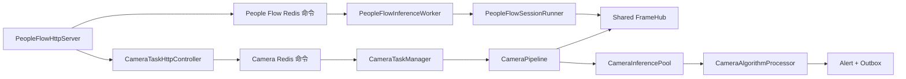
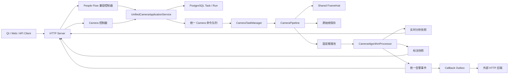
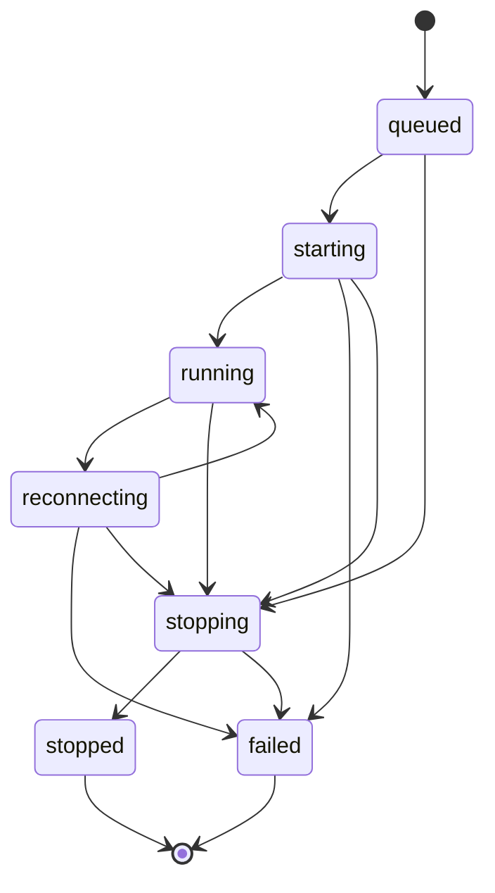

# People Flow 与 Camera 业务无损合并重构方案

> 文档状态：Draft / 待评审
> 版本：1.0
> 编制日期：2026-07-25
> 适用仓库：`vision_project-main`
> 核心约束：不删减、不改变原有项目功能，只合并 People Flow 与 Camera 两套业务运行链路

---

## 1. 文档目的

本文档给出一套可分阶段实施、可验证、可灰度、可回滚的项目重构方案。

本次重构不重新设计算法，不改变模型输出，不改变摄像头接入方式，不改变现有抽帧、保存、告警、回调、Qt 或 Web 功能。重构的唯一业务目标是：

1. 将 People Flow 和 Camera Task 从两套任务入口、两套运行状态和两套线程生命周期，收敛为一个统一的摄像头分析任务模型；
2. 形成统一链路：HTTP 接收任务 → 校验与解析 → 创建 Run → 启动摄像头 Pipeline → 抽帧 → 推理 → 状态算法 → 告警 → HTTP 查询或回调；
3. 保留 `/api/v1/people-flow/*` 和 `/api/v1/cameras/*` 的现有行为；
4. 将 Qt 中的 People Flow 展示能力同步迁移到现有 Web 控制台，但 Qt 在本次重构范围内继续可用；
5. 在所有兼容性和验收测试通过前，不删除旧接口、旧表、旧代码和回滚开关。

---

## 2. 执行摘要

当前项目并非缺少完整算法链路，而是存在两个并行的业务编排方式：

- People Flow 链路通过 `/people-flow/*` 创建临时 Session，由 `PeopleFlowInferenceWorker` 和 `PeopleFlowSessionRunner` 管理；
- Camera 链路通过 `/cameras/*` 管理持久化 Camera Definition 和 Run，由 `CameraTaskManager` 和 `CameraPipeline` 管理；
- 两者已经共享 `SharedCameraFrameHubRegistry`，但仍分别维护任务、状态、快照、事件和生命周期；
- Camera 链路已经具备固定推理池、`CameraAlgorithmProcessor`、告警持久化、outbox 和 HTTP 回调，并已经支持 `people_flow` 算法。

目标架构以 Camera Run 为唯一运行时任务，以 Camera Pipeline 为唯一摄像头消费管线。People Flow 不再拥有独立采集或推理运行时，而是成为 Camera Run 中的一组算法能力和一个旧 API 兼容视图。

重构完成后的原则是：

> 一个摄像头 Run、一个生命周期、一个 Pipeline、一份帧上下文、多种算法能力、多种兼容输出。

旧 People Flow API 不直接访问旧 Worker，而是通过兼容控制器调用统一应用服务，并将统一结果转换为旧 JSON、JPEG 和事件结构。旧 Qt 客户端因此无需同步修改。

---

## 3. 范围与非目标

### 3.1 本次范围

- People Flow 和 Camera Task 的任务模型合并；
- HTTP 控制层合并；
- Redis 命令、租约和热状态合并；
- Worker 内运行时和线程生命周期合并；
- People Flow 实时指标接入统一 Camera Run；
- People Flow 标注快照接入统一 Camera Run；
- People Flow 过线事件接入统一告警事件；
- 四阶段安全状态接入统一分析快照；
- PostgreSQL 新旧数据兼容；
- `/people-flow/*` 旧接口兼容；
- `/cameras/*` 现有接口兼容；
- Qt 客户端兼容；
- Web 控制台增加 Qt 当前展示能力；
- 构建、测试、启动、运维、监控和回滚流程更新。

### 3.2 明确不做

- 不替换 YOLO/TensorRT 模型；
- 不改变算法规则、阈值、类别或四阶段含义；
- 不改变 RTSP Profile 的安全管理方式；
- 不允许 HTTP 请求提交 RTSP URI、密码、回调 URL 或数据库连接串；
- 不改为“每个摄像头一个模型实例”；
- 不取消固定大小推理池；
- 不改变 FrameHub 的共享解码设计；
- 不取消 JPEG 抽帧、归档或保留清理；
- 不取消告警 outbox、重试、dead-letter 或 HMAC；
- 不删除 Qt；
- 不删除 `/people-flow/*`；
- 不删除 `pf_*` 历史表；
- 不在本次重构中实现多 Worker 共享同一摄像头；
- 不把长时间摄像头任务改成同步阻塞 HTTP 请求。

### 3.3 “功能不变”的定义

“功能不变”指外部可观察能力保持不变：

- 原有合法请求继续成功；
- 原有错误场景继续返回相同 HTTP 状态码和 `error_code`；
- 原有 JSON 字段不删除、不改名、不改变类型；
- 原有 JPEG 快照继续可获取；
- 原有 People Flow 计数、跟踪、重连、预热和事件行为继续存在；
- 原有 Camera 抽帧、分析、告警、回调、运行历史和运维行为继续存在；
- Qt 原有操作流程继续通过合约测试；
- Web 原有功能继续存在，并增加 Qt 展示能力；
- 历史数据可继续查询；
- 安全边界和敏感信息隔离不降低。

允许的变化仅限内部类、模块依赖、数据来源、线程归属和兼容适配实现。

---

## 4. 当前架构基线

### 4.1 当前外部入口

People Flow：

- `POST /api/v1/people-flow/start`
- `POST /api/v1/people-flow/{session_id}/stop`
- `GET /api/v1/people-flow/{session_id}/status`
- `GET /api/v1/people-flow/{session_id}/snapshot`
- `GET /api/v1/people-flow/{session_id}/security`
- `GET /api/v1/people-flow/cameras/{camera_id}/realtime`
- `GET /api/v1/people-flow/cameras/{camera_id}/events`

Camera：

- `POST/GET /api/v1/cameras`
- `GET/PATCH/DELETE /api/v1/cameras/{camera_id}`
- `POST /api/v1/cameras/{camera_id}/start`
- `POST /api/v1/cameras/{camera_id}/stop`
- `GET /api/v1/cameras/{camera_id}/status`
- `GET /api/v1/cameras/{camera_id}/latest-frame`
- `GET /api/v1/cameras/{camera_id}/runs`
- `GET /api/v1/cameras/{camera_id}/alerts`
- Camera Profile、FrameHub 和运维接口

### 4.2 当前 Worker 结构



### 4.3 当前已具备、应直接复用的能力

- 一个 Profile 只打开一次 FFmpeg reader；
- 帧对象使用不可变共享所有权；
- 每个 Camera Run 一条 Pipeline 线程；
- 抽帧节拍与算法节拍相互独立；
- 固定大小推理池；
- 每个摄像头最多保留一个 latest-only 待推理任务；
- Camera 到推理 Worker 的稳定亲和；
- Run generation/lease fencing；
- 算法 Session 按稳定 camera ID 管理；
- 告警和 outbox 同事务写入；
- 回调租约、退避、重试和 dead-letter；
- PostgreSQL 持久化与 Redis 热状态分工；
- Qt、Postman、CTest、硬件和长稳验证基础。

### 4.4 当前需要解决的结构问题

1. 同一摄像头可能存在 People Flow Session 和 Camera Run 两种业务身份；
2. 两套 start/stop 命令和状态键并存；
3. `VisionWorkerHost` 同时启动 People Flow role 和 Camera Task role；
4. People Flow 的实时计数、标注快照和四阶段状态没有进入 Camera Run 热状态；
5. Camera Pipeline 已执行 `people_flow`，但 People Flow API 仍读取旧 Redis/Repository；
6. `pf_sessions`、`pf_crossing_events` 与 `security_alert_events` 存在重复业务表达；
7. Qt 只能读取旧 People Flow API；
8. Web 只展示 Camera 抽帧控制面，缺少算法实时展示；
9. 旧链路与新链路在重连预热、存储降级、快照生成等细节上仍可能产生行为差异。

---

## 5. 目标架构

### 5.1 目标运行链路



### 5.2 目标组件职责

#### `UnifiedCameraApplicationService`

统一用例入口，负责：

- 创建、更新、启动、停止 Camera；
- 将持久化 Camera Definition 转换成不可变 RunSpec；
- 将旧 People Flow start 请求转换成不可变 RunSpec；
- 生成 Run、检查并发、写入数据库并投递命令；
- 提供 session ID、run ID、camera ID 的映射；
- 统一幂等、状态机、错误码和事务边界；
- 屏蔽 HTTP 控制器对 Redis 和 Repository 的直接编排。

#### `CameraTaskHttpController`

继续提供现有 Camera API，但生命周期操作委托给统一应用服务。控制器只负责：

- 鉴权；
- HTTP/JSON 校验；
- ETag 和 Idempotency-Key；
- 统一结果到 Camera API JSON 的映射。

#### `PeopleFlowCompatibilityController`

继续提供现有 People Flow API，不包含独立业务运行逻辑。负责：

- 保持旧请求和响应格式；
- 保持旧 HTTP 状态码与 `error_code`；
- 将 `session_id` 映射到统一 `run_id`；
- 将统一分析快照转换成旧 status/security/realtime JSON；
- 将统一标注帧转换成旧 snapshot JPEG；
- 将统一告警转换成旧 crossing event JSON；
- 查询切换前的历史 `pf_*` 数据。

#### `CameraTaskManager`

成为唯一长运行摄像头任务管理器：

- 消费统一 Camera 命令；
- 保证同一 camera ID 最多一个活动 Run；
- 启停并 join Pipeline；
- 执行租约和 generation fencing；
- 处理启动恢复和旧 Worker 遗留 Run；
- 暴露 Pipeline 快照。

#### `CameraPipeline`

成为唯一摄像头帧消费 Pipeline：

- 订阅 Shared FrameHub；
- 维护抽帧、算法和标注快照独立节拍；
- 可选保存原始 JPEG；
- 提交 latest-only 推理任务；
- 传播 reconnect generation；
- 发布采集、抽帧、丢帧和队列状态；
- 停止时依次取消、排空、detach、释放订阅。

#### `CameraAlgorithmProcessor`

成为 People Flow 和安全分析的唯一状态算法容器：

- 检测结果适配；
- 人员跟踪；
- 过线计数；
- occupancy；
- 电子围栏；
- Pose 动作；
- Temporal 动作；
- 重连后的预热和状态处理；
- 生成实时分析快照；
- 生成统一告警；
- 生成渲染所需的只读结果；
- Run 替换时释放旧 Session。

#### `CameraAnalysisSnapshotStore`

统一实时结果读模型：

- Redis 保存热状态，设置 TTL；
- PostgreSQL保存最终状态和必要的恢复数据；
- HTTP Server 只读取，不直接触碰 Worker 内对象；
- Worker 心跳只承载进程级汇总，不承载每摄像头完整业务状态。

---

## 6. 统一领域模型

### 6.1 稳定身份

| 概念 | 含义 | 规则 |
|---|---|---|
| `camera_id` | 外部稳定摄像头身份 | Camera API 和 People Flow API 共享 |
| `task_id` | Camera Definition 主键 | 兼容期保持与 `camera_id` 相同 |
| `run_id` | 一次启动产生的不可变运行实例 | 全局唯一 |
| `session_id` | 旧 People Flow 对 Run 的别名 | 兼容启动时可直接等于 `run_id` |
| `camera_profile` | 服务端允许列表中的 RTSP 配置引用 | 不包含明文 URI |
| `definition_version` | Camera Definition 乐观锁版本 | Run 启动后不变 |
| `worker_generation` | Worker 租约 fencing token | 防止旧 Worker 回写 |

推荐兼容策略：

- 旧 People Flow 创建的 `session_id` 继续使用 `pf_*` 前缀；
- 该值同时作为统一 `run_id`，避免新增不必要的映射表；
- Run 的 `origin` 标记为 `people_flow_compat`；
- Camera API 创建的 Run 继续使用 `cr_*`；
- 所有业务数据内部只以 `run_id` 关联。

### 6.2 `CameraRunSpec`

新增只读运行定义，创建后不可修改：

```text
CameraRunSpec
├── run_id
├── camera_id / task_id
├── origin
├── camera_profile
├── definition_version
├── frame_output
│   ├── enabled
│   ├── interval_ms
│   ├── mode
│   ├── jpeg_quality
│   ├── max_width / max_height
│   └── retention
├── analysis
│   ├── enabled
│   ├── target_infer_fps
│   ├── algorithm_profile
│   ├── algorithms[]
│   ├── config_version
│   ├── initial_occupancy
│   ├── snapshot_fps
│   └── algorithm_parameters
├── callback_profile
├── create_time_ms
└── compatibility
    ├── legacy_session_id
    ├── preserve_pf_projection
    └── legacy_response_version
```

设计要求：

- Camera Definition 是可修改配置；
- Camera RunSpec 是一次启动时的不可变快照；
- 运行中的定义修改必须先停止旧 Run，再创建新 Run；
- 旧 People Flow 的 `initial_occupancy` 和 `config_version` 只进入 RunSpec，不应覆盖 Camera Definition；
- 算法线程不读取会在运行中变化的 HTTP 请求对象或全局临时变量。

### 6.3 实时分析快照

新增 `CameraAnalysisSnapshot`：

```text
CameraAnalysisSnapshot
├── camera_id / run_id
├── status
├── config_version
├── capture
│   ├── state / backend / shared_hub
│   ├── hub_instance_id / hub_subscribers
│   ├── capture_fps / source_fps
│   ├── frame_count / dropped_frames
│   ├── latest_frame_age_ms
│   └── width / height
├── inference
│   ├── infer_fps
│   ├── last_inference_ms
│   └── live_persons
├── people_flow
│   ├── initial_occupancy
│   ├── in_count
│   ├── out_count
│   └── occupancy
├── security
│   ├── phase1
│   ├── phase2
│   ├── phase3
│   └── phase4
├── storage
│   ├── degraded
│   ├── event_queue_depth
│   └── snapshot_degraded
├── reconnect_count
├── last_alert
├── snapshot_revision
├── last_update_ms
├── error_code
└── last_error
```

快照发布规则：

- Worker 是唯一写者；
- Redis 是运行中热状态；
- HTTP Server 是只读者；
- TTL 不小于当前状态轮询窗口的三倍；
- 终态写入 PostgreSQL 后再释放 Redis 热状态；
- 旧 Worker generation 不得覆盖新 Run；
- HTTP 不得把缺失或过期快照伪装成零值健康状态。

### 6.4 统一告警模型

保留 `alert_event.v1` 为规范告警模型。

People Flow 过线事件映射：

| 旧字段 | 统一告警字段 |
|---|---|
| `event_id` | `event_id` |
| `session_id` | `run_id` |
| `camera_id` | `task_id/camera_id` |
| `line_id` | `payload.line_id` |
| `direction` | `payload.direction` |
| `track_id` | `track_id` |
| `event_time_ms` | `occurred_at_ms` |
| `confidence` | `confidence` |
| `point_x_norm/y_norm` | `payload.crossing_point` |
| `config_version` | `algorithm.config_version` |
| `evidence_path` | `evidence.snapshot_url/frame_id` |

兼容 API 输出时，再将统一告警投影回旧结构。

### 6.5 统一 Run 状态机



兼容约束：

- 不新增会破坏旧客户端判断的公共状态值；
- People Flow status 将同一 Run 状态映射为原有 Session 状态；
- 定义替换期间，数据库可以短暂同时存在旧 `stopping` Run 和新 `queued`
  Run，但运行时任何时刻只能有一条 Pipeline 持有该 camera 的有效 generation；
- 告警是 Run 中产生的事件，不是 Run 终态；
- Worker 重启只能恢复有合法租约和 generation 的 Run；
- 终态 Run 不得被重新启动，重新启动必须创建新的 Run。

---

## 7. API 兼容设计

### 7.1 总体策略

- 不删除现有路由；
- 不改变现有请求结构；
- 不改变既有响应字段；
- 新字段只能以可选字段方式增加；
- 旧接口内部改为委托统一应用服务；
- 新 Web 优先使用 `/cameras/*` 和新增的 Camera 分析读接口；
- Qt 继续调用 `/people-flow/*`；
- 兼容接口和 Camera 接口必须操作同一个 Run。

### 7.2 People Flow API 映射

#### `POST /api/v1/people-flow/start`

保持：

- Bearer 鉴权；
- 禁止 RTSP URI；
- `camera_profile`、`camera_id`、`config_version`、`initial_occupancy`；
- `camera_id`、`camera_profile` 和 `config_version` 必须继续匹配当前部署允许的
  People Flow 配置，不能借兼容接口绕过 Camera Profile 管理；
- `202` 和 `session_id`；
- 重复活动摄像头返回 `409 CAMERA_ALREADY_ACTIVE`；
- 原有输入上下限和错误码。

内部流程：

1. 校验旧请求；
2. 检查兼容全局活动限制和 camera 活动 Run；
3. 确保存在可关联的 Camera Definition；
4. 创建 `origin=people_flow_compat` 的 RunSpec；
5. 强制包含原有 People Flow 和安全算法集合；
6. `session_id = run_id`；
7. 写 Run 和兼容 `pf_sessions` 初始投影；
8. 投递统一 Camera start 命令；
9. 返回原有 JSON。

不得直接启动 `PeopleFlowSessionRunner`。

#### `POST /api/v1/people-flow/{session_id}/stop`

内部调用统一 `stopRun(session_id)`，响应转换回：

- `session_id`
- `status`
- `stop_requested`
- 原有错误码和状态码

必须保留当前终态 Session 再次 stop 时返回
`409 SESSION_ALREADY_FINISHED` 的行为，不在本次重构中将其改成新的幂等语义。

#### `GET /api/v1/people-flow/{session_id}/status`

优先读取统一 Run + `CameraAnalysisSnapshot`，输出原有：

- `capture`
- `inference`
- `flow`
- `storage`
- `source`
- 时间字段
- `snapshot_url`
- `security_url`
- `error/last_error`

若 session 属于切换前旧数据，则回退到旧 Redis/PostgreSQL 读取。

#### `GET /api/v1/people-flow/{session_id}/snapshot`

优先返回统一 Run 的最新标注 JPEG。

必须保持：

- `Content-Type: image/jpeg`
- 原有 404/503 行为；
- 不返回任意文件路径；
- 路径必须位于规范化允许根目录；
- snapshot 更新失败只设置 `snapshot_degraded`，不得无条件停止整个摄像头 Run。

#### `GET /api/v1/people-flow/{session_id}/security`

将 `CameraAnalysisSnapshot.security` 转换为原有四阶段 JSON。必须保留：

- `phase1` 到 `phase4`；
- phase4 的 `demo_classifier` 标识；
- 原有事件、状态和版本字段；
- 无安全数据时的原有 404 或空状态语义。

#### `GET /api/v1/people-flow/cameras/{camera_id}/realtime`

查询该 camera 当前活动 Run；仅当存在 `people_flow` 算法状态时返回旧实时结构。

#### `GET /api/v1/people-flow/cameras/{camera_id}/events`

- 新事件读取 `security_alert_events` 中 People Flow/line crossing 类别；
- 旧历史读取 `pf_crossing_events`；
- 结果按 `event_time_ms,event_id` 合并、去重、倒序；
- 保持 `limit`、错误码和 JSON 结构；
- 兼容期不删除旧事件。

### 7.3 Camera API

原有 Camera API 保持不变。

建议以新增方式补充：

- `GET /api/v1/cameras/{camera_id}/analysis`
- `GET /api/v1/cameras/{camera_id}/latest-frame?view=raw|annotated`
- `GET /api/v1/cameras/{camera_id}/alerts?category=&event_type=&run_id=`

兼容规则：

- 未传 `view` 时维持当前原始抽帧行为；
- `annotated` 仅新增，不覆盖现有 latest-frame 文件；
- 旧客户端不需要理解新增字段；
- Camera start 的 `202`、幂等键、ETag 和状态 URL 不变。

### 7.4 HTTP 返回语义

长运行摄像头任务继续异步返回：

```json
{
  "success": true,
  "camera_id": "entry_camera_01",
  "run_id": "cr_xxx",
  "status": "queued",
  "status_url": "/api/v1/cameras/entry_camera_01/status",
  "alerts_url": "/api/v1/cameras/entry_camera_01/alerts"
}
```

告警结果通过：

- Alerts 查询；
- People Flow events 兼容查询；
- HTTP callback；
- Web 轮询，后续可选 SSE。

本次重构不让 start 请求阻塞等待摄像头最终告警。

---

## 8. 数据库与 Redis 迁移

### 8.1 数据原则

- 只做向前兼容的增量迁移；
- 不删除或重命名旧表；
- 不修改历史行的业务含义；
- 新旧版本可以在同一数据库上启动；
- 回滚后的旧程序可以忽略新增表和列；
- Schema 迁移必须幂等；
- 数据写入必须携带 Run ID 和 fencing 条件。

### 8.2 建议新增 PostgreSQL 迁移

新增：

```text
db/postgresql/003_people_flow_camera_unification.sql
```

建议内容：

1. `camera_task_runs` 增加：
   - `origin TEXT NOT NULL DEFAULT 'camera_api'`
   - `legacy_session_id TEXT`
   - `analysis_config_version TEXT`
2. 新增 `camera_run_analysis_results`：
   - `run_id` 主键和外键；
   - `task_id`；
   - `initial_occupancy`；
   - `in_count/out_count/final_occupancy`；
   - `last_live_persons`；
   - `security_state_json`；
   - `snapshot_relative_path`；
   - `storage_degraded/snapshot_degraded`；
   - `last_update_ms`；
   - `finalized_at_ms`。
3. 为 `legacy_session_id` 建唯一索引；
4. 为 camera + origin + create_time 建索引；
5. Schema version 增加新版本记录。

是否把完整实时状态持续写 PostgreSQL应受节流控制；建议仅按低频更新和终态强制落库，避免每帧写库。

### 8.3 旧 People Flow 表处理

以下表保留：

- `pf_sessions`
- `pf_crossing_events`
- `pf_aggregates_minute`
- `pf_calibration_audit`

处理方式：

- 切换前历史数据永久可读；
- 新 `people_flow_compat` Run 继续生成兼容投影；
- 投影是兼容读模型，不再拥有独立运行时；
- `pf_crossing_events` 写入与规范告警写入应在同一数据库事务完成；
- `pf_sessions` 终态与 `camera_task_runs` 终态一起提交；
- `pf_aggregates_minute` 继续按旧聚合规则更新；
- calibration audit 保持原有写入和查询语义；
- 后续是否停止写旧表属于另一个版本，不在本次范围。

### 8.4 Redis 键设计

新增或统一：

```text
yolo:camera:run:{run_id}
yolo:camera:analysis:{run_id}
yolo:camera:active:{camera_id}
yolo:camera:lease:{camera_id}
yolo:camera:stop:{run_id}
```

旧键：

```text
yolo:pf:...
```

兼容策略：

- 旧 HTTP 读取逻辑先读统一键；
- 旧历史或旧运行模式才读 `yolo:pf:*`；
- 切换初期可由兼容投影器更新必要旧键；
- 稳定后停止新写旧键，但保留旧读直到明确下线；
- 禁止同一 Run 同时由旧 People Flow Worker 和新 Camera Pipeline 持有租约。

### 8.5 数据一致性

必须满足：

- 告警和 callback outbox 同事务；
- People Flow crossing 兼容投影和规范告警同事务，或使用可重放 outbox；
- Run 终态和最终计数不能出现互相矛盾；
- `initial + in - out = final_occupancy` 的一致性检查继续存在；
- event fingerprint 继续用于幂等；
- 旧 Worker generation 不能覆盖新 Worker 状态；
- HTTP 查询必须标识热状态是否缺失或过期。

---

## 9. 线程、资源和生命周期

### 9.1 目标线程模型

```text
HTTP Server
├── Crow HTTP 线程池
└── 不加载 CUDA、不持有 RTSP、不创建摄像头线程

Vision Worker
├── Camera 命令消费线程 × 1
├── 每活动 Camera Run 的 Pipeline 线程 × N
├── Shared Hub reader：每活动 Profile × 1
├── Frame Artifact Writer 固定线程池
├── Camera Inference 固定线程池 × W
├── Callback Delivery 线程 × 1
├── Retention Sweeper × 1
└── Heartbeat × 1
```

移除的是 People Flow 的独立业务线程角色，不是 People Flow 算法。

### 9.2 Pipeline 启动顺序

1. 校验 RunSpec；
2. 获取 camera Run lease；
3. 将 Run 从 `queued` 转换为 `starting`；
4. 注册算法 Session generation；
5. 订阅 Shared FrameHub；
6. 等待第一帧；
7. 按独立节拍提交抽帧和分析；
8. 第一项有效工作提交后转 `running`；
9. 周期发布进度和续租。

### 9.3 Pipeline 停止顺序

1. 标记 `stopping`；
2. 停止提交新抽帧和推理任务；
3. 使 generation 失效，拒绝晚到推理结果；
4. 从推理池 detach camera；
5. 排空该 Run 的 Frame Writer；
6. 发布最终分析快照；
7. 持久化最终计数和兼容 `pf_sessions`；
8. 释放 FrameHub subscription；
9. 释放租约；
10. 转换为 `stopped` 或 `failed`；
11. join Pipeline 线程。

### 9.4 重连行为

必须保持旧 People Flow 行为：

- Hub 断流是共享 camera/profile 级故障；
- Run 状态进入 `reconnecting`；
- 记录 reconnect generation；
- 恢复后重置或保留状态必须与当前 People Flow 规则一致；
- `warmup_frames_after_reconnect` 必须重新生效；
- 预热期不产生错误过线告警；
- 快照、抽帧 writer 的局部失败不能停止 Hub；
- 最后一个订阅释放后才允许 Hub idle grace 关闭。

### 9.5 背压

- FrameHub 不保存无界历史；
- Pipeline 每次读取最新帧；
- 推理池每 camera 最多一个 pending latest job；
- 保存队列满时只增加 dropped 指标；
- 算法任务积压时丢弃旧帧而不是无限延迟；
- 回调失败不得阻塞推理；
- PostgreSQL 短时失败应进入降级或有限重试，不能阻塞 RTSP reader。

---

## 10. People Flow 行为等价要求

统一处理器必须逐项保留：

- PersonDetectorAdapter 过滤；
- PersonTracker 生命周期、稳定 ID、轨迹和速度；
- LineCrossingCounter；
- 初始 occupancy；
- IN/OUT 和 occupancy 计算；
- live persons；
- 配置版本；
- reconnect warmup；
- 电子围栏 enter/dwell/exit；
- pose action；
- temporal action；
- phase1 到 phase4 状态；
- phase4 demo classifier 标记；
- 标注快照；
- snapshot degraded；
- storage degraded；
- event queue depth；
- crossing event 持久化；
- 分钟聚合；
- calibration audit；
- stop/failure 后最终一致性检查。

不得仅保留“产生告警”，而丢失实时计数、快照或旧报表数据。

---

## 11. Web 与 Qt 方案

### 11.1 Qt

本次重构中：

- Qt 代码不删除；
- Qt 继续调用原有 `/people-flow/*`；
- Qt 不感知后端已切换到统一 Camera Run；
- `tools/qt_demo_contract_test.py` 必须持续通过；
- Qt 的请求字段、轮询频率和错误展示不要求同步修改。

### 11.2 Web

保留 `/camera-admin` 路径，控制台名称可从“摄像头抽帧控制台”调整为“视觉分析控制台”。

现有页面继续保留：

- 摄像头；
- Camera Profile；
- Shared Hub；
- 运行概览；
- 原始最新帧；
- Run 历史；
- Camera CRUD 和 start/stop。

新增页面或区域：

#### 运行总览

- 在线摄像头；
- 活动 Run；
- 运行/重连/失败数量；
- 采集 FPS；
- 推理 FPS；
- 推理队列丢弃；
- 今日告警；
- callback pending/retry/dead-letter。

#### 实时监控

- Camera 选择；
- Run 状态；
- 标注 JPEG；
- occupancy；
- IN/OUT；
- live persons；
- capture/infer FPS；
- phase1 到 phase4；
- 最新告警；
- reconnect 和数据新鲜度。

#### 告警中心

- 过线；
- 电子围栏；
- Pose；
- Temporal；
- camera/run/category/time 筛选；
- delivery 状态；
- 证据快照；
- dead-letter 运维入口。

#### Camera 编辑

在现有抽帧字段基础上增加：

- analysis enabled；
- target infer FPS；
- algorithm profile；
- algorithms 多选；
- callback profile；
- People Flow 初始 occupancy 或 profile 参数；
- 标注快照开关和频率。

### 11.3 Web 实时策略

第一阶段使用与 Qt 相同的轮询方式：

- 状态和实时指标：1 秒；
- JPEG 快照：1 秒或受配置节流；
- 告警：3 至 5 秒；
- 运维指标：5 秒。

第二阶段可新增 SSE，但不是本次业务合并的上线前置条件。

### 11.4 Web 安全

- Token 只保存在当前页面内存；
- Camera 管理接口和新增 Web 分析接口继续要求 Bearer 鉴权；
- `/people-flow/*` 兼容路由严格保持当前鉴权矩阵：start/stop 要求
  Bearer，status/snapshot/security/realtime/events 不在本次重构中新增强制鉴权；
- 不展示 RTSP URI、密码、HMAC secret 或 DSN；
- CSP 保持 `default-src 'self'`；
- 图片只允许同源和 blob；
- DOM 输出必须转义；
- 不把后端错误堆栈直接返回浏览器。

---

## 12. 配置重构

### 12.1 兼容期配置

保留现有：

- `people_flow`
- `camera_tasks`
- `analysis`
- `callbacks`
- `camera_hub`
- `worker`
- `redis`

新增建议：

```yaml
runtime:
  unified_camera_pipeline: false
  people_flow_compatibility: true
  legacy_people_flow_fallback: true
  shadow_compare: false
```

### 12.2 配置映射

统一模式启用时：

- `people_flow` 中算法、计数、跟踪和安全配置继续作为算法 Profile 默认值；
- `camera_tasks` 继续负责 Run、抽帧、输出和租约配置；
- `analysis` 继续负责固定推理池；
- `callbacks` 保持不变；
- `people_flow.target_infer_fps`、`snapshot_fps`、`initial_occupancy` 可由兼容 RunSpec 覆盖；
- Server 与 Worker 必须验证统一开关一致；
- 配置不一致时 `/ready` 失败，而不是静默运行两套链路。

### 12.3 最终配置方向

稳定后可将 `people_flow` 重命名为算法 Profile 配置，但本次不删除旧配置键。新旧名称的消歧和正式废弃属于后续版本。

---

## 13. 代码变更设计

### 13.1 建议新增文件

```text
include/server/unified_camera_application_service.h
src/server/unified_camera_application_service.cpp

include/server/people_flow_compatibility_controller.h
src/server/people_flow_compatibility_controller.cpp

include/server/camera_run_spec.h
include/server/camera_analysis_snapshot.h

include/server/camera_analysis_snapshot_store.h
src/server/redis_camera_analysis_snapshot_store.cpp

include/business/people_flow_compatibility_projection.h
src/business/people_flow_compatibility_projection.cpp

db/postgresql/003_people_flow_camera_unification.sql

tests/unified_camera_application_service_test.cpp
tests/people_flow_compatibility_contract_test.cpp
tests/camera_analysis_snapshot_test.cpp
tests/unified_pipeline_behavior_parity_test.cpp
tests/unified_pipeline_reconnect_test.cpp
tests/web_admin_contract_test.py
```

### 13.2 主要修改文件

| 文件/模块 | 修改方向 |
|---|---|
| `people_flow_http_server.*` | 组合统一应用服务和兼容控制器；后续可改名但首期不改 |
| `camera_task_http_controller.*` | 生命周期委托统一应用服务 |
| `vision_worker_host.*` | 统一模式下不启动独立 People Flow Worker |
| `camera_task_manager.*` | 支持 Run origin、兼容 session ID、统一恢复 |
| `camera_pipeline.*` | 增加标注快照节拍、reconnect generation 和分析快照发布 |
| `camera_inference_pool.*` | 传播 generation、RunSpec 和推理指标 |
| `camera_algorithm_processor.*` | 输出完整 People Flow/安全快照与渲染结果 |
| `camera_task_repository.*` | Run origin、最终分析结果、兼容事务投影 |
| `redis_task_queue.*` | 统一命令和 per-run 分析热状态 |
| `app_config.*` | 统一运行开关和一致性校验 |
| `algorithm_task.v1.schema.json` | 仅增加可选算法参数，保持 v1 兼容 |
| `web/camera-admin/*` | 增加实时监控、算法配置、告警中心 |
| `scripts/start_demo.ps1` | 增加统一模式启动和就绪检查 |
| `scripts/test_all.ps1` | 纳入兼容和 Web 合约测试 |
| `README.md`、`docs/ARCHITECTURE.md` | 更新运行链路和迁移说明 |

### 13.3 暂不删除

- `PeopleFlowInferenceWorker`
- `PeopleFlowSessionRunner`
- `PeopleFlowRepository`
- Qt 客户端；
- 旧 Redis 方法；
- 旧数据库表；
- 旧测试；
- 旧配置键。

它们在兼容期充当回滚实现或历史数据读层。只有后续独立清理版本才允许删除。

---

## 14. 分阶段实施计划

### R0：行为冻结与基线

目标：把“功能不变”转化为自动化证据。

任务：

- 保存现有 People Flow API Golden JSON；
- 保存现有 Camera API Golden JSON；
- 固化 Qt 合约；
- 固化算法确定性输入/输出；
- 记录 P6 硬件指标；
- 记录 Redis 键、PostgreSQL 行和输出文件；
- 增加旧错误码矩阵；
- 确认所有敏感字段扫描规则。

退出条件：

- 当前全部 CTest 通过；
- Qt 合约通过；
- Camera API 合约通过；
- P5/P6 验证脚本基线可重复；
- Golden 数据入库。

### R1：引入统一应用服务，不切换运行时

目标：抽出统一 start/stop/use-case 边界，但旧 Worker 行为不变。

任务：

- 新增 `UnifiedCameraApplicationService`；
- Camera 控制器委托应用服务；
- 旧 People Flow 控制器暂时保留旧路径；
- Repository 和 Redis 访问从 HTTP 控制器移入应用服务；
- 增加单元和事务测试。

退出条件：

- Camera API 完全无差异；
- 旧 People Flow 完全无差异；
- 不新增摄像头线程；
- 可通过开关回退到旧控制器编排。

### R2：统一 RunSpec 和数据结构

目标：所有新 Camera Run 使用不可变 RunSpec。

任务：

- 新增 `CameraRunSpec`；
- 新增数据库 003 迁移；
- 扩展命令序列化；
- 增加 origin、config version、initial occupancy；
- 保持旧命令反序列化兼容；
- 增加 Redis/DB migration 测试。

退出条件：

- 新旧命令均可消费；
- 旧数据库可无损升级；
- 回滚程序可继续读取；
- Camera Run 行为不变。

### R3：补齐统一 Pipeline 的 People Flow 等价能力

目标：Camera Pipeline 输出旧 People Flow 所需全部状态。

任务：

- 完整实时计数快照；
- phase1 到 phase4；
- 标注 JPEG；
- snapshot/storage degraded；
- reconnect warmup；
- 分钟聚合和 calibration；
- 最终一致性；
- 兼容事件投影；
- 差分测试旧 Runner 与新 Pipeline。

退出条件：

- 同一确定性帧序列下，计数和事件完全一致；
- 快照业务元素一致；
- 重连测试一致；
- 所有旧 People Flow 业务测试通过；
- 统一 Pipeline 可独立完成完整链路。

### R4：接入 People Flow 兼容控制器

目标：旧 API 操作统一 Camera Run。

任务：

- start/stop/status/realtime/snapshot/security/events 全部适配；
- 保持 session ID；
- 保持重复启动、停止和错误码；
- 支持新旧历史双读；
- Qt 连接真实统一后端验证。

退出条件：

- `tools/qt_demo_contract_test.py` 通过；
- 新增真实后端兼容合约通过；
- 旧请求/响应 Golden diff 为零；
- 旧 People Flow Worker 可通过开关恢复。

### R5：Worker 默认统一

目标：一个 Worker 只运行 Camera Pipeline。

任务：

- `VisionWorkerHost` 统一模式下不启动旧 People Flow role；
- 启动协调防止双消费；
- 完成 Run lease fencing；
- 更新 heartbeat/readiness；
- 更新 Hub subscriber 类型；
- 故障和恢复演练。

退出条件：

- 同一 camera 不存在两条业务 Pipeline；
- 单 RTSP reader 不变；
- 固定推理池数量不变；
- Worker 重启恢复正确；
- `/ready` 能检测配置不一致和旧 Worker。

### R6：Web 功能对等

目标：Web 覆盖 Qt 当前展示能力，且不依赖 `/people-flow/*`。

任务：

- 增加算法配置；
- 增加实时监控；
- 增加 occupancy/IN/OUT/live persons；
- 增加 phase1 到 phase4；
- 增加标注快照；
- 增加告警中心；
- 增加前端合约和浏览器测试。

退出条件：

- Web 不调用 `/people-flow/*`；
- Web 与 Qt 对同一 Run 展示结果一致；
- 原 Camera Admin 功能无回归；
- Token 和 CSP 安全检查通过。

### R7：集成、性能和硬件验收

目标：证明功能、可靠性和性能不退化。

任务：

- 全量 CTest；
- PostgreSQL/Redis 集成；
- RTSP + TensorRT 硬件测试；
- 断流重连；
- Worker 重启；
- Callback 重试/dead-letter；
- 60 分钟 soak；
- 多 Camera 压力；
- Golden 结果和性能差分。

退出条件：

- 功能验收矩阵全部通过；
- 无 P0/P1 缺陷；
- 资源使用在批准阈值内；
- 回滚演练成功。

### R8：发布与观察

目标：统一运行时成为默认，但保留回滚。

任务：

- 测试环境启用；
- 单摄像头试运行；
- 逐步扩大；
- 观察错误率、丢帧、告警和回调；
- 保留旧代码和开关至少一个发布观察周期；
- 输出验收记录。

退出条件：

- 观察期无功能差异；
- 数据一致；
- Qt、Web 和外部 callback 正常；
- 批准进入长期维护。

---

## 15. 测试方案

### 15.1 单元测试

- RunSpec 构建与不可变性；
- People Flow 请求到 RunSpec 映射；
- Camera Definition 到 RunSpec 映射；
- session ID/run ID 映射；
- 状态机合法转换；
- JSON 兼容映射；
- snapshot TTL 和过期；
- event 兼容投影；
- generation fencing；
- reconnect warmup；
- occupancy 一致性。

### 15.2 API 合约测试

必须覆盖：

- 全部 People Flow 路由；
- 全部 Camera 路由；
- 原有成功响应；
- 400/401/404/409/413/503；
- 禁止敏感字段；
- Bearer 鉴权；
- ETag；
- Idempotency-Key；
- JPEG Content-Type；
- limit/offset/filter；
- People Flow 终态 Session 重复 stop 的 `409 SESSION_ALREADY_FINISHED`；
- 活动 camera 冲突。

### 15.3 行为差分测试

使用同一确定性帧序列分别运行：

- 旧 `PeopleFlowSessionRunner`；
- 新 `CameraPipeline + CameraAlgorithmProcessor`。

比较：

- detections；
- track ID 生命周期；
- live persons；
- IN/OUT；
- occupancy；
- crossing event；
- security event；
- phase 状态；
- reconnect 前后行为；
- 最终 session/run 统计；
- 标注快照的业务元素。

浮点字段允许明确的数值容差；事件数量、方向、ID 关联和状态转换不得模糊比较。

### 15.4 数据库测试

- 空库迁移；
- 现有 001/002 升级；
- 003 重复执行；
- 新版本写入后旧版本只读/启动；
- 告警 + outbox 原子性；
- 告警 + `pf_crossing_events` 兼容投影一致性；
- 活动 Run 唯一索引；
- Worker generation 冲突；
- 历史事件双读去重；
- 终态计数一致性。

### 15.5 并发与故障测试

- 同 camera 两个 start；
- People Flow start 与 Camera start 并发；
- stop 与推理结果并发；
- PATCH 替换与 callback 并发；
- Worker 在 queued/starting/running/stopping 崩溃；
- Redis 短时不可用；
- PostgreSQL 短时不可用；
- RTSP 断流和恢复；
- Frame writer 队列满；
- inference latest-only 替换；
- callback 超时、429、5xx、4xx；
- dead-letter replay。

### 15.6 Web 测试

- 页面资源可加载；
- CSP；
- Token 不落 localStorage；
- Camera CRUD；
- start/stop；
- 实时指标；
- raw/annotated 快照；
- 告警筛选；
- 错误提示；
- HTML 转义；
- 轮询停止和页面切换资源释放。

### 15.7 验证命令

保留并扩展：

```powershell
powershell -ExecutionPolicy Bypass -File .\scripts\test_all.ps1
powershell -ExecutionPolicy Bypass -File .\scripts\verify_camera_frame_feature.ps1
powershell -ExecutionPolicy Bypass -File .\scripts\verify_algorithm_service_p6.ps1
python .\tools\qt_demo_contract_test.py
```

新增统一链路验收脚本：

```powershell
powershell -ExecutionPolicy Bypass -File .\scripts\verify_unified_camera_pipeline.ps1
```

---

## 16. 功能验收矩阵

| 功能 | 旧入口 | 新核心 | 验收要求 |
|---|---|---|---|
| People Flow 启动 | `/people-flow/start` | Camera Run | 响应与错误码不变 |
| People Flow 停止 | `/people-flow/{id}/stop` | stopRun | 幂等不变 |
| 实时人数 | realtime/status | Analysis Snapshot | 数值一致 |
| 过线计数 | status/events | Processor + Alert | 数量、方向一致 |
| 四阶段 | security | Analysis Snapshot | 字段、状态一致 |
| 标注快照 | snapshot | Annotated Snapshot | JPEG 可用 |
| Camera CRUD | `/cameras` | Camera Definition | 行为不变 |
| Camera start/stop | camera routes | Camera Run | 行为不变 |
| 原始抽帧 | latest-frame | Frame Writer | 文件与响应不变 |
| 归档与保留 | Camera 配置 | Frame Writer/Sweeper | 行为不变 |
| 算法分析 | Camera analysis | Processor | 行为不变 |
| 告警查询 | camera alerts | Alert Repository | 行为不变 |
| HTTP 回调 | outbox | Callback Worker | 重试语义不变 |
| Qt | 旧 API | Compat Controller | 无需修改即可运行 |
| Web 原功能 | camera-admin | Camera API | 无回归 |
| Web 新监控 | 无 | Camera analysis API | 覆盖 Qt 展示 |
| 历史 People Flow | pf tables | 双读 | 可继续查询 |

---

## 17. 可观测性

### 17.1 日志关联字段

所有链路日志至少包含：

- `request_id`
- `camera_id`
- `task_id`
- `run_id`
- `legacy_session_id`
- `worker_consumer`
- `worker_generation`
- `hub_instance_id`
- `source_sequence`
- `event_id`

不得记录：

- RTSP 明文 URI；
- 用户名、密码；
- callback secret；
- Authorization；
- DSN；
- 完整 callback 响应正文。

### 17.2 指标

保留现有指标并增加：

- `unified_camera_active_runs`
- `unified_camera_run_starts_total{origin}`
- `unified_camera_run_failures_total{error_code}`
- `camera_analysis_snapshot_age_ms`
- `camera_analysis_frames_total`
- `camera_analysis_submit_drops_total`
- `people_flow_compat_requests_total{route,status}`
- `people_flow_compat_projection_failures_total`
- `people_flow_compat_legacy_fallback_reads_total`
- `annotated_snapshot_failures_total`
- `run_generation_conflicts_total`

### 17.3 就绪检查

统一模式下 `/ready` 必须检查：

- Server 与 Worker 模式一致；
- 只有一个有效 Vision Worker；
- CameraTaskManager 运行；
- Shared Hub Registry 可用；
- 推理 Worker 全部 ready；
- Algorithm Processor 运行；
- Snapshot Store 可写；
- Callback Worker 按配置 ready；
- PostgreSQL schema 已升级；
- Redis heartbeat 新鲜；
- 未检测到旧 People Flow Worker 同时持有活动任务。

---

## 18. 安全要求

- HTTP Server 不加载 CUDA、TensorRT 或摄像头凭证；
- Worker 负责解析允许列表 Profile；
- RTSP URI 不进入 HTTP JSON、Redis 命令、日志或 Web；
- callback 继续只使用服务端 profile；
- HMAC 和重试语义不变；
- SQL 使用参数绑定；
- 所有 identifier 继续校验；
- 文件读取继续限制在规范化允许根目录；
- 禁止符号链接/reparse point 逃逸；
- RunSpec 和告警 payload 禁止秘密字段；
- 兼容控制器保持现有路由级鉴权行为，不在重构中收紧或放宽；
- 新 Web API 不降低鉴权要求；
- 若未来需要为 People Flow 只读接口强制鉴权，应作为单独的 API
  安全版本变更实施，不能混入本次无损业务合并。

---

## 19. 发布、灰度与回滚

### 19.1 发布顺序

1. 部署兼容数据库迁移；
2. 部署包含双模式代码的 Server/Worker；
3. 保持 `unified_camera_pipeline=false` 验证旧模式；
4. 停止活动 People Flow Session；
5. 切换测试 camera 到统一模式；
6. 验证 Qt、Web、DB、Redis、callback；
7. 扩大 camera 范围；
8. 全量切换；
9. 保留旧实现和配置开关。

### 19.2 防止双运行

切换前必须：

- 拒绝新 start；
- 等待活动旧 Session 停止；
- 确认旧 People Flow consumer 不持有租约；
- 确认 Redis active key 清理或过期；
- 再允许统一 Camera Run 启动。

不得用“同时跑两套生产链路并比较告警”的方式灰度，因为会造成重复事件、重复回调和状态竞争。差分比较应使用无副作用 shadow processor 或离线确定性帧。

### 19.3 回滚条件

出现以下任一情况立即回滚：

- People Flow 计数差异不可解释；
- 重复告警或重复回调；
- 同 camera 双 RTSP reader；
- Run 无法停止或租约冲突；
- Qt 合约失败；
- Web 原 Camera 功能回归；
- 数据库一致性失败；
- callback dead-letter 异常增长；
- 推理吞吐显著低于批准阈值；
- 敏感信息泄露。

### 19.4 回滚步骤

1. 暂停新任务接收；
2. 请求统一 Run 停止并等待 join；
3. 确认 Worker generation 和租约释放；
4. 设置 `unified_camera_pipeline=false`；
5. 启动保留的旧 People Flow role；
6. 恢复任务接收；
7. 验证 Qt、People Flow API 和事件；
8. 保留新增表和列，不执行逆向删除；
9. 输出事故和数据差异报告。

数据库增量对象不需要回滚删除，避免二次破坏。

---

## 20. 风险清单

| 风险 | 影响 | 缓解措施 |
|---|---|---|
| 旧 Runner 与新 Pipeline 计数细节不同 | People Flow 数值变化 | 确定性差分测试，逐字段冻结 |
| reconnect 未重置预热 | 误告警 | 传播 source generation，专项测试 |
| 标注快照与原始抽帧互相覆盖 | UI/取证错误 | raw/annotated 分目录和接口参数 |
| 旧事件与新告警重复 | 查询和回调重复 | fingerprint、事务投影、双读去重 |
| 两套 Worker 同时消费 | 双 RTSP、双告警 | 模式握手、租约 fencing、ready 失败 |
| People Flow 初始人数覆盖 Camera 定义 | 后续 Run 配置污染 | 只写不可变 RunSpec override |
| Redis 热状态过期显示零值 | 假健康 | 明确 stale/unavailable |
| PostgreSQL 写入拖慢推理 | 帧延迟 | 异步/节流快照，latest-only |
| Qt 兼容响应细节遗漏 | 客户端回归 | Golden JSON + Qt 合约 |
| Web 扩展引入 XSS/Token 泄漏 | 安全问题 | DOM 转义、内存 Token、CSP |
| 回滚时新旧数据不兼容 | 恢复失败 | 只做增量迁移、旧表保留 |

---

## 21. 完成定义

只有同时满足以下条件，本次重构才算完成：

1. 所有 People Flow 请求由统一应用服务和 Camera Pipeline 执行；
2. 生产模式不再启动独立 `PeopleFlowSessionRunner`；
3. People Flow 算法、计数、快照、安全状态和事件功能完整保留；
4. 所有 Camera 抽帧、保存、分析、告警和回调功能完整保留；
5. `/people-flow/*` 外部契约无破坏；
6. `/cameras/*` 外部契约无破坏；
7. Qt 不修改也能通过完整真实后端流程；
8. Web 覆盖 Qt 展示能力，且 Web 不调用 `/people-flow/*`；
9. 历史 `pf_*` 数据仍可查询；
10. 新告警、outbox 和兼容投影一致；
11. 同一 Camera Run 只有一条 Pipeline；
12. 同一 Profile 仍只有一个 FrameHub reader；
13. 推理池大小不随摄像头数量增长；
14. 重连、Worker 崩溃、Redis/PostgreSQL 故障测试通过；
15. 60 分钟硬件 soak 通过；
16. 安全扫描和敏感字段检查通过；
17. 回滚演练通过；
18. 架构、API、运维和验收文档更新完成。

---

## 22. 建议评审结论

建议批准以下架构决策：

1. Camera Run 作为唯一运行时任务；
2. Camera Pipeline 作为唯一摄像头业务 Pipeline；
3. People Flow 作为统一 Algorithm Processor 中的算法能力；
4. `/people-flow/*` 作为兼容控制器长期保留；
5. Qt 在本次范围内保留；
6. Web 在现有 `camera-admin` 基础上扩展；
7. `pf_*` 表作为历史和兼容投影保留；
8. 数据库只做增量迁移；
9. 使用 feature flag 分阶段切换；
10. 旧运行时至少保留一个稳定观察周期，用于快速回滚。

该方案能够在不改变原有外部功能的前提下，消除 People Flow 与 Camera 两套独立业务编排，使后续新增算法只需要接入统一的 Camera Run、Inference Pool、Algorithm Processor、Alert 和 Web 展示链路。
